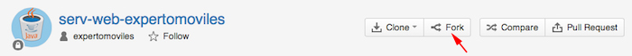
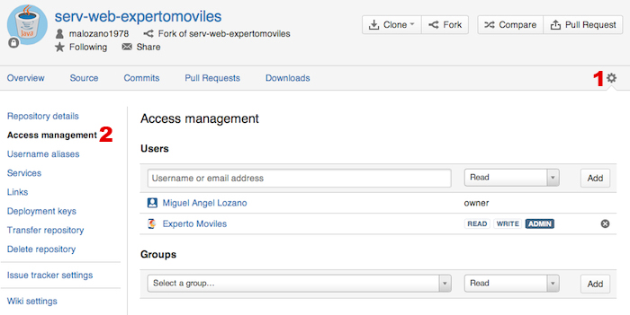

# Ejercicios de acceso a la red

<!--
Antes de empezar a crear los proyectos, debes descargarte las plantillas desde bitbucket. Para ello:

* Entraremos en nuestra cuenta de `bitbucket.org`, seleccionaremos el repositorio git `expertomoviles/serv-web-expertomoviles` (del que tendremos únicamente permisos de lectura), y haremos un _Fork_ de dicho repositorio en nuestra cuenta, para así tener una copia propia del repositorio con permisos de administración.




* Para evitar que bitbucket nos dé un error por sobrepasar el número de usuarios permitidos, debemos ir al apartado _Access management_ de las preferencias del repositorio que acabamos de crear y eliminar los permisos de lectura para el grupo _Estudiantes_ (tendremos estos permisos concedidos si al hacer el _Fork_ hemos especificado que se hereden los permisos del proyecto original). Los únicos permisos que debe tener nuestro repositorio deben ser para el propietario (_owner_) y para el usuario _Experto Moviles_.


--->

<!--
* Una vez tenemos nuestra copia del repositorio con las plantillas correctamente configuradas en bitbucket, haremos un `clone` en nuestra máquina local:
```bash
git clone https://[usr]:bitbucket.org/[usr]/serv-web-expertomoviles
```
* De esta forma se crea en nuestro ordenador el directorio `serv-web-expertomoviles` y se descargan en él las plantillas para los ejercicios del módulo y un fichero `.gitignore`. Además, ya está completamente configurado y conectado con nuestro repositorio remoto, por lo que lo único que deberemos hacer será subir los cambios conforme realicemos los ejercicios, utilizando los siguientes comandos:
```bash
git add . git commit -a -m "[Mensaje del commit]" git push origin master
```
-->

> Nota: Los ejercicios de esta sesión se deben realizar tanto en Android como en iOS (en las sesiones correspondientes).

## Visor de HTML (1 punto)

Vamos a hacer una aplicación que nos permita visualizar el código HTML de la URL que indiquemos. En las plantillas de la sesión encontramos el proyecto `LectorHtml` que podemos utilizar como base, tanto en versión iOS como Android. Este proyecto contiene una pantalla con un cuadro de edición texto para introducir la URL, un botón para cargar la URL, y un visor de texto donde deberemos mostrar los resultados obtenidos cuando se pulse el botón. Se pide:

_a)_ Implementar el código necesario para que cuando se pulse el botón se realice una conexión a la URL indicada, se obtenga el resultado como texto, y se muestre en el visor de texto (por el momento podemos realizar la conexión de forma síncrona para simplificar).

> Ayuda Android: IMPORTANTE!, en primer lugar debemos añadir los permisos necesarios a `AndroidManifest.xml` (de no hacer esto, nos parecerá que el emulador no tiene acceso a la red). Trabajaremos con la clase `LectorHtmlActivity`. Implementaremos la conexión en el método `getContent`, que deberá devolver el resultado como una cadena de texto. En el evento del botón deberemos realizar la conexión llamando al método anterior.

> Ayuda iOS: Trabajaremos con la clase `UAViewController`. Concretamente la conexión deberá ser iniciada en el método `conectarUrl`.

_b)_ Modificar el código anterior para que la conexión se realice de forma asíncrona.

> Ayuda Android: Seguiremos trabajando en la misma clase. Deberemos utilizar la tarea asíncrona `TareaConexionUrl`, iniciándola desde el evento del botón, en lugar de llamar directamente al método que realiza la conexión.


> Ayuda iOS: La conexión se deberá iniciar en el mismo método `conectarUrl`, pero ahora se lanzará de forma asíncrona utilizando `self` como delegado.

_c)_ Mostrar en la barra de estado un indicador de actividad de red mientras se descarga el HTML. Haz también que el botón se deshabilite mientras dura la descarga. Recuerda que la tarea de descarga podría terminar tanto de forma normal, como por ser cancelada.

> Ayuda Android: En Android será en la tarea asíncrona donde deberemos mostrar u ocultar el indicador de progreso indeterminado cuando corresponda.

> Ayuda iOS: Activa o desactiva el indicador de actividad desde los métodos adecuados del delegado.


Para probar el proceso de carga en Android podemos simular conexiones lentas, yendo en Eclipse a la perspectiva DDMS, y en la vista _Emulator Control_ buscar la sección _Telephony Status_ y dentro de ella el campo _Speed_. Aquí podremos seleccionar el tipo de red que queremos simular (para conexiones muy lentas podemos coger GSM). También se puede cambiar conectando vía telnet al emulador:
<br\>

 `telnet localhost 5554`<br/>
 `network delay gprs`<br/>
 `OK`<br/>
 `network speed gsm`<br/>
 `OK`


## Carga de imágenes (1 punto)

Vamos a implementar una aplicación que nos permita visualizar una lista de _tweets_, y que al pulsar sobre cada uno de ellos nos aparezca la imagen de perfil del usuario que lo envió, junto al mensaje completo. Se proporciona en las plantillas una aplicación `ClientTwitter` que utilizaremos como base. En la pantalla principal veremos un listado de _tweets_, pero nos centraremos en la pantalla de detalles del _tweet_. En esta pantalla recibiremos la URL de la imagen de perfil, pero no la imagen. Tendremos que descargarla de la red de forma asíncrona y mostrarla en pantalla en el `ImageView` destinado a tal fin.

> Ayuda Android: Trabajaremos con la clase `DatosTweetActivity`. Implementa en ella una `AsyncTask` para cargar las imágenes. En el método `getImagen` construye un `Bitmap` a partir del contenido devuelto. En la `AsyncTask`, una vez obtenida la imagen muéstrala en el `ImageView` disponible. En `onCreate` lanza la tarea asíncrona para conectar a la URL de la imagen.

> Ayuda iOS: Trabajaremos con la clase `UADetallesTweetViewController`, en su método `configureView` deberemos inicializar la conexión para obtener la imagen del tweet de forma asíncrona. Una vez obtenida la respuesta, en en el método `connectionDidFinishLoading:` creamos la imagen a partir de los datos descargados y la mostramos en pantalla.


## Carga lazy de imágenes (1 punto)

Sobre el proyecto del ejercicio anterior, vamos ahora a cargar las imágenes conforme visualizamos el listado de _tweets_, y no sólo al entrar en los detalles de cada uno de ellos. Esta carga de imágenes la vamos a implementar de forma _lazy_, es decir, deberemos cargarlas conforme se solicita que se muestren las celdas en pantalla, no antes. La carga deberá realizarse en segundo plano.

> Nota: Una vez se ha descargado una imagen, podemos guardarla en el campo `image` del objeto `Tweet` correspondiente. De esta forma la próxima vez que mostremos el mismo _tweet_ no será necesario volverla a descargar.

Tenemos una implementación parcial de la descarga _lazy_ de imágenes, sólo tendremos que introducir el código para lanzar la descarga de cada imagen. Ya damos implementados los componentes para descargar las imágenes en segundo plano, sólo tendremos que inicializarlos cada vez que se visualiza una imagen.

> Ayuda Android: La descarga _lazy_ en Android se implementa en el adaptador `TweetAdapter`. En su método `cargarImagen` deberemos lanzar la tarea para cargar las imágenes de forma asíncrona, que ya se proporciona implementada. Así se iniciará la descarga conforme se las imágenes se muestran en pantalla. Añade en ese método las imágenes que se estén descargando al mapa `imagenesCargando`, para no descargar dos veces el mismo _tweet_.

> Ayuda iOS: La descarga _lazy_ en iOS deberá inicializarse en la clase `UAListadoTweetsViewController`. En `cargarImagen:paraIndexPath:` debemos inicializar la descarga de la imagen de una fila utilizando la clase `UAImageDownloader` que ya se proporciona. Actuaremos como delegados de dicha clase, de forma que al finalizar la descarga llamará a nuestro método `imageDownloader:didFinishDownloadingImage:forIndexPath:`, en el que recibiremos la imagen descargada. Deberemos introducir el código necesario en dicho método para mostrar la imagen en la tabla.


De forma opcional, como optimización puedes implementar también las siguientes funcionalidades:

* No descargar imágenes mientras se hace _scroll_.
* Permitir que las imágenes se eliminen en condiciones de baja memoria.
* Guardar las imágenes de forma persistente en el directorio de caché (se puede utilizar la URL como nombre de los ficheros).
