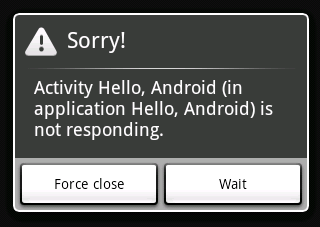

# Acceso a la red con Android

En esta sesión vamos a ver cómo acceder a la red desde las aplicaciones Android. La forma habitual de acceder a servidores en Internet es mediante protocolo HTTP, mediante la URL en la que se localizan los recursos a los que queremos acceder.

Una consideración que debemos tener en cuenta es que las operaciones de red son operaciones lentas, y deberemos llevar cuidado para que no bloqueen la interfaz de nuestra aplicación. En esta sesión veremos cómo establecer este tipo de conexiones de forma correcta desde nuestras aplicaciones para móviles.

## Conexión a URLs en Android

Vamos a comenzar viendo cómo conectar con URLs desde aplicaciones Android. Lo habitual será realizar una petición GET a una URL y obtener el documento que nos devuelve el servidor, por lo que las APIs de acceso a URLs nos facilitarán fundamentalmente esta operación. Sin embargo, como veremos más adelante también será posible realizar otras operaciones HTTP, como POST, PUT o DELETE, entre otras.

Como paso previo, para todas las conexiones por Internet en Android necesitaremos declarar los permisos en el `AndroidManifest.xml`, fuera del `application` tag:

```bash
<uses-permission android:name="android.permission.INTERNET" />
```


Las conexiones por HTTP son las más comunes en las comunicaciones de red. En Android podemos utilizar la clase `HttpURLConnnection` en combinación con `Url`. Estas clases son las mismas que están presentes en Java SE, por lo que el acceso a URLs desde Android se puede hacer de la misma forma que en cualquier aplicación Java. Podemos ver información de las cabeceras de HTTP como se muestra a continuación (la información se añade a un `TextView`):

```java
TextView textView = (TextView)findViewById(R.id.tvVisor);
textView.setText("Conexión http.\n\n");
try {
  textView.setText("Cabeceras www.ua.es:\n");
  URL url = new URL("http://www.ua.es");
  HttpURLConnection http = (HttpURLConnection)url.openConnection();
  textView.append(" longitud = "+http.getContentLength()+"\n");
  textView.append(" encoding = "+http.getContentEncoding()+"\n");
  textView.append(" tipo = "+http.getContentType()+"\n");
  textView.append(" response code = "+http.getResponseCode()+"\n");
  textView.append(" response message = "+http.getResponseMessage()+"\n");
  textView.append(" content = "+http.getContent()+"\n");
} catch (MalformedURLException e) {
} catch (IOException e) {
}
```

Sin embargo, en Android resulta más común utilizar la libería _Apache Http Client_.
La librería de Java SE está diseñada de forma genérica, para soportar cualquier tipo de protocolo, mientras que _HttpClient_ se centra en HTTP y con ella resulta más sencillo utilizar este protocolo.

La forma más sencilla de acceso con esta librería es la siguiente:

```java
HttpClient client = new DefaultHttpClient();
HttpGet request = new HttpGet("http://www.ua.es");
try {
    ResponseHandler<String> handler = new BasicResponseHandler();
    String contenido = client.execute(request, handler);
} catch (ClientProtocolException e) {
} catch (IOException e) {
} finally {
    client.getConnectionManager().shutdown();
}
```

Con esta librería tenemos un objeto cliente, y sobre él podemos ejecutar peticiones.
Cada petición se representa en un objeto, cuya clase corresponde con el tipo de petición
a realizar. Por ejemplo, lo más común será realizar una petición GET, por lo que utilizaremos una instancia de `HttpGet` que construiremos a partir de la URL a la que debe
realizar dicha petición.

Para obtener la respuesta, en caso de que queramos obtenerla como una cadena, lo cual
también es lo más habitual, podemos utilizar un `BasicResponseHandler`, que se encarga de obtener el contenido en forma de `String`.

Por último, en el `finally` deberemos cerrar todas las conexiones del cliente HTTP
si no lo vamos a utilizar más. Hay que destacar que el cliente (`HttpClient`) puede
utilizarse para realizar varias peticiones. Lo cerraremos cuando no vayamos a realizar
más peticiones con él.

En el ejemplo anterior hemos visto el caso en el que nos interesaba obtener la respuesta como cadena. Sin embargo, puede interesarnos obtener otros formatos, o tener más información sobre la respuesta HTTP (no sólo el contenido):


```java
HttpClient client = new DefaultHttpClient();
HttpGet request = new HttpGet("http://www.ua.es/imagenes/logoua.png");
try {
    HttpResponse response = client.execute(request);
    InputStream in = response.getEntity().getContent();

    Bitmap imagen = BitmapFactory.decodeStream(in);
} catch (ClientProtocolException e) {
} catch (IOException e) {
} finally {
    client.getConnectionManager().shutdown();
}
```


Este es el caso general, en el que obtenemos la respuesta como un objeto `HttpResponse` del que podemos leer todas las propiedades de la respuesta HTTP. La parte más destacada de la respuesta es el bloque de contenido (`HttpEntity`). De la entidad podemos obtener sus propiedades, como su tipo MIME, longitud, y un flujo de entrada para leer el contenido devuelto. En caso de que dicho contenido sea texto, será más sencillo leerlo como en el ejemplo previo.


## Conexiones asíncronas en Android

En Internet no se puede asumir que ninguna operación de red vaya a ser rápida o vaya a durar un tiempo limitado (el limite lo establece, en todo caso, el timeout de la conexión). En los dispositivos móviles, todavía menos, ya que continuamente pierden calidad de la señal o pueden cambiar de Wifi a 3G sin preguntarnos, y perder conexiones o demorarlas durante el proceso.

Si una aplicación realiza una operación de red en el mismo hilo de la interfaz gráfica, el lapso de tiempo que dure la conexión, la interfaz gráfica dejará de responder. Este efecto es indeseable ya que el usuario no lo va a comprender, ni aunque la operación dure sólo un segundo. Es más, si la congelación dura más de dos segundos, es muy probable que el sistema operativo muestre el diálogo ANR, "Application not responding", invitando al usuario a matar la aplicación:



<!--

-->

Para evitar esto hay que realizar las conexiones de forma asíncrona, fuera del hilo de eventos de nuestra aplicación. En Android deberemos ser nosotros lo que creemos otro hilo (`Thread`) de ejecución en el que se realice la conexión.

Durante el tiempo que dure la conexión la aplicación podrá seguir funcionando de forma normal, será decisión nuestra cómo interactuar con el usuario durante este tiempo. En algunos casos nos puede interesar mostrar una diálogo de progreso que evite que se pueda realizar ninguna otra acción durante el acceso. Sin embargo, esto es algo que debemos evitar siempre que sea posible, ya que el abuso de estos diálogos entorpecen el uso de la aplicación. Resulta más apropiado que la aplicación siga pudiendo ser utilizada por el usuario durante este tiempo, aunque siempre deberemos indicar de alguna forma que se está accediendo a la red. Para ello normalmente contaremos en la barra de estado con un indicador de actividad de red, que deberemos activar al comenzar la conexión, y desactivar cuando se cierre. A continuación veremos cómo utilizar estos elementos en Android.


<!--
 
-->

En Android, una forma sencilla de realizar una conexión de forma asíncrona es utilizar hilos, de la misma forma que en Java SE:

```java
ImageView imageView = (ImageView)findViewById(R.id.ImageView01);
new Thread(new Runnable() {
  public void run() {
    Drawable imagen = cargarLaImagen("http://...");
    //Desde aquí NO debo acceder a imageView
  }
}).start();
```

Pero hay un problema: tras cargar la imagen no puedo acceder a la interfaz gráfica porque la GUI de Android sigue un modelo de hilo único: sólo un hilo puede acceder a ella. Se puede solventar de varias maneras. Una es utilizar el método `View.post(Runnable)`.

```java
ImageView imageView = (ImageView)findViewById(R.id.ImageView01);
new Thread(new Runnable() {
  public void run() {
    Drawable imagen = cargarLaImagen("http://...");
    imageView.post(new Runnable() {
      public void run() {
        imageView.setDrawable(imagen);
      }
    });
  }
}).start();
```

Con esto lo que se hace es indicar un fragmento de código que debe ejecutarse en el hilo principal de eventos. En dicho fragmento de código se realizan los cambios necesarios en la interfaz. De esta forma, una vez la conexión ha terminado de cargar de forma asíncrona, desde el hilo de la conexión de introduce en el hilo principal de la UI el código que realice los cambios necesarios para mostrar el contenido obtenido.

Como alternativa, contamos también con el método `Activity.runOnUiThread(Runnable)` para ejecutar un bloque de código en el hilo de la UI:

```java
ImageView imageView = (ImageView)findViewById(R.id.ImageView01);
new Thread(new Runnable() {
  public void run() {
    Drawable imagen = cargarLaImagen("http://...");
    runOnUiThread(new Runnable() {
      public void run() {
        imageView.setDrawable(imagen);
      }
    });
  }
}).start();
```

Con esto podemos crear conexiones asíncronas cuyo resultado se muestre en la UI. Sin embargo, podemos observar que generan un código bastante complejo. Para solucionar este problema a partir de Android 1.5 se introduce la clase `AsyncTask` que nos permite implementar tareas asíncronas de forma más elegante. Se trata de una clase creada para facilitar el trabajo con hilos y con interfaz gráfica, y es muy útil para ir mostrando el progreso de una tarea larga, durante el desarrollo de ésta. Nos facilita la separación entre tarea secundaria e interfaz gráfica permitiéndonos solicitar un refresco del progreso desde la tarea secundaria, pero realizarlo en el hilo principal.


```java
TextView textView;
ImageView[] imageView;

public void bajarImagenes(){
	textView = (TextView)findViewById(R.id.TextView01);
	imageView[0] = (ImageView)findViewById(R.id.ImageView01);
	imageView[1] = (ImageView)findViewById(R.id.ImageView02);
	imageView[2] = (ImageView)findViewById(R.id.ImageView03);
	imageView[3] = (ImageView)findViewById(R.id.ImageView04);

	new BajarImagenesTask().execute(
		"http://a.com/1.png",
		"http://a.com/2.png",
		"http://a.com/3.png",
		"http://a.com/4.png");
}

private class BajarImagenesTask extends
                        AsyncTask<String, Integer, List<Drawable>> {
     @Override
     protected List<Drawable> doInBackground(String... urls) {
         ArrayList<Drawable> imagenes = new ArrayList<Drawable>();
         for(int i=1;i<urls.length; i++) {
           cargarLaImagen(urls[0]);
           publishProgress(i);
         }
         return imagenes;
     }

     @Override
     protected void onPreExecute() {
       setProgressBarIndeterminateVisibility(true);
       textView.setText("Comenzando la descarga ...");
     }

     @Override
     protected void onProgressUpdate(Integer... values) {
       textView.setText(values[0] + " imagenes cargadas...");
     }

     @Override
     protected void onPostExecute(List<Drawable> result) {
	   setProgressBarIndeterminateVisibility(false);
       textView.setText("Descarga finalizada");

       for(int i=0; i<result.length; i++){
         imageView[i].setDrawable(result.getItemAt(i));
       }
     }

     @Override
     protected void onCancelled() {
       setProgressBarIndeterminateVisibility(false);
     }
}
```


> La notación `(String ... values)` indica que hay un número indeterminado de parámetros, y se accede a ellos con `values[0], values[1],` ..., etcétera. Forma parte de la sintaxis estándar de Java.

Lo único que se ejecuta en el segundo hilo de ejecución es el bucle
del método `doInBackground(String...)`. El resto de métodos
se ejecutan en el mismo hilo que la interfaz gráfica.

Podemos observar que en la `AsyncTask` se especifican tres tipos
utilizando genéricos:

```java
class Tarea extends AsyncTask<Entrada, Progreso, Resultado>
```


El primer tipo es el que se recibe como datos de entrada. Realmente se recibe un número variable de objetos del tipo indicado. Cuando ejecutamos la tarea con `execute` deberemos especificar como parámetros de la llamada dicha lista de objetos, que serán recibidos por el método `doInBackground`. Este método es el que implementará la tarea a realizar de forma asíncrona, y al ejecutarse en segundo plano deberemos tener en cuenta que <strong>nunca</strong> deberemos realizar cambios en la interfaz desde él. Cualquier cambio en la interfaz deberemos realizarlo en alguno de los demás métodos.

El segundo tipo de datos que se especifica es el tipo del progreso. Conforme avanza la tarea en segundo plano podemos publicar actualizaciones del progreso realizado. Hemos dicho que desde el método `doInBackground` no podemos modificar la interfaz, pero si que podemos llamar a `publishProgress` para solicitar que se actualice la información de progreso de la tarea, indicando como información de progreso una lista de elementos del tipo indicado como tipo de progreso, que habitualmente son de tipo entero (`Integer`). Tras hacer esto se ejecutará el método `onProgressUpdate` de la tarea, que recibirá la información que pasamos como parámetro. Este método si que se ejecuta dentro del hilo de la interfaz, por lo que podremos actualizar la visualización del progreso dentro de él, en función de la información recibida. Es importante entender que la ejecución de `onProgressUpdate(...)` no tiene por qué ocurrir inmediatamente después de la petición `publishProgress(...)`, o puede incluso no llegar a ocurrir.


Por último, el tercer tipo corresponde al resultado de la operación. Es el tipo que devolverá `doInBackground` tras ejecutarse, y lo recibirá `onPostExecute` como parámetro. Este último método podrá actualizar la interfaz con la información resultante de la ejecución en segundo plano.

También contamos con el método `onPreExecute`, que se ejecutará justo antes de comenzar la tarea en segundo plano, y `onCancelled`, que se ejecutará si la tarea es cancelada (una tarea se puede cancelar llamando a su método `cancel`, y en tal caso no llegará a ejecutarse `onPostExecute`). Estos métodos nos van a resultar de gran utilidad para gestionar el indicador de actividad de la barra de estado. Este indicador se activa y desactiva mediante el siguiente método de la actividad:

```java
// Mostrar indicador de actividad en la barra de estado
setProgressBarIndeterminateVisibility(true);

// Ocultar indicador de actividad en la barra de estado
setProgressBarIndeterminateVisibility(false);
```

Lo habitual será activarlo en `onPreExecute`, y desactivarlo tanto en `onPostExecute` como en `onCancelled`. Este indicador informa al usuario de que la aplicación está trabajando, pero no da información concreta sobre el progreso (por eso se llama _Indeterminate_). Para poder utilizar este tipo de progreso, al crear la actividad deberemos haberlo solicitado:

```java
@Override
protected void onCreate(Bundle savedInstanceState) {
    super.onCreate(savedInstanceState);
    getWindow().requestFeature(Window.FEATURE_INDETERMINATE_PROGRESS);
    ...
}
```

También contamos con una barra de progreso en la barra de estado, que podemos activar con `setProgressBarVisibility`, habiéndola solicitado previamente con:

```java
@Override
protected void onCreate(Bundle savedInstanceState) {
    super.onCreate(savedInstanceState);
    getWindow().requestFeature(Window.FEATURE_PROGRESS);
    ...
}
```

En este caso, deberemos modificar el progreso mientras se realiza la carga. El progreso se indicará mediante un valor de 0 a 10000, y se actualizará mediante el método `setProgress(int)` de la actividad. Podemos llamar a este método desde `onProgressUpdate`, tal como hemos visto anteriormente:

```java
@Override
protected void onProgressUpdate(Integer... values) {
    setProgress(values[0] * 10000 / numero_imagenes);
}
```

## Comprobación de la conectividad en Android

En algunas aplicaciones puede convenir comprobar el estado de red. El estado de red no es garantía de que la conexión vaya a funcionar, pero sí que puede prevenirnos de intentar establecer una conexión que no vaya a funcionar. Por ejemplo, hay aplicaciones que requieren el uso de la WIFI para garantizar mayor velocidad.

Cuando desarrollemos una aplicación que acceda a la red deberemos tener en cuenta que el usuario normalmente contará con una tarifa de datos limitada, en la que una vez superado el límite o bien se le tarificará por consumo, o bien se le reducirá la velocidad de conexión. Por este motivo, deberemos llevar especial cuidado con las operaciones de red, y velar al máximo por reducir el consumo de datos del usuario.

En ciertas ocasiones esto puede implicar limitar ciertas funcionalidades de la aplicación a las zonas en las que contemos con conexión Wi-Fi, o por lo menos avisar al usuario en caso de que solicite una de estas operaciones mediante 3G, y darle la oportunidad de cancelarla.


A continuación se muestra cómo usar el `ConnectivityManager` para comprobar el estado de red en dispositivos Android.

```java
ConnectivityManager cm = (ConnectivityManager)
    getSystemService(Context.CONNECTIVITY_SERVICE);
NetworkInfo wifi = cm.getNetworkInfo(ConnectivityManager.TYPE_WIFI);
NetworkInfo mobile = cm.getNetworkInfo(ConnectivityManager.TYPE_MOBILE);
boolean hayWifi = wifi.isAvailable();
boolean hayMobile = mobile.isAvailable();
boolean noHay = (!hayWifi && !hayMobile); // Iiinteerneer!!
```

El `ConnectivityManager` también puede utilizarse para controlar el estado de red, o bien estableciendo una preferencia pero permitiéndole usar el tipo de conectividad que realmente está disponible,

```java
cm.setNetworkPreference(NetworkPreference.PREFER_WIFI);
```

o bien pidiéndole explícitamente que se desconecte de la red móvil y se conecte a la red WiFi:

```java
cm.setRadio(NetworkType.MOBILE,false);
cm.setRadio(NetworkType.WIFI,true);
```

## Carga lazy de imágenes en Android

Otro caso típico en el trabajo con HTTP es el de cargar una lista de imágenes para
almacenarlas o bien mostrarlas. Lo más habitual es tener un componente de tipo lista
o tabla, en el que para cada elemento se muestra una imagen como icono. En una primera
aproximación, tal como hemos visto en alguno de los ejemplo anteriores, podríamos
cargar todas las imágenes al cargar los datos de la lista, y tras ello actualizar la interfaz. Sin embargo, esto tiene serios problemas. El primero de ellos es el tiempo que pueden tardar en cargarse todas las imágenes de una lista. Podría dejar al usuario en espera durante demasiado tiempo. Por otro lado, estaríamos cargando todas las imágenes, cuando es posible que el usuario no esté interesado en recorrer toda la lista, sino
sólo sus primeros elementos. En este caso estaríamos malgastando la tarifa de datos del usuario de forma innecesaria.


Un mejor enfoque para la carga de imágenes de listas es hacerlo de forma _lazy_, es
decir, cargar la imagen de una fila sólo cuando dicha fila se muestre en pantalla. Además,
cada imagen se cargará de forma asíncrona, mediante su propio hilo en segundo plano, y cuando la carga se haya completado se actualizará la interfaz. El efecto que esto producirá será que veremos como van apareciendo las imágenes una a una, conforme se completa su carga. Vamos a ver ahora algunas recetas para implementar este comportamiento en Android e iOS.

Como mejora, también se suele hacer que la carga _lazy_ sólo se produzca en el caso
en el que no estemos haciendo _scroll_ en la lista. Es posible que el usuario está buscando  un determinado elemento en una larga lista, o que esté interesado en los últimos elementos. En tal caso, mientras hace _scroll_ rápidamente para llegar al elemento buscado será recomendable evitar que las imágenes por las que pasemos se pongan en la lista de carga, ya que en principio el usuario no parece interesado en ellas. Esto se puede implementar de forma sencilla atendiendo a los eventos del _scroll_, y añadiendo las imágenes a la cola de descargas sólo cuando se encuentre detenido.

Según la aplicación, también podemos guardar las imágenes de forma persistente, de forma que en próximas visitas no sea necesario volver a descargarlas. En caso de tener un conjunto acotado de elementos a los que accedamos frecuentemente, puede ser recomendable almacenarlos en una base de datos propia, junto con su imagen. De no ser así, podemos almacenar las imágenes en una caché temporal (`Context.getCacheDir()` en Android, `NSCachesDirectory` en iOS).

### Carga lazy en Android

En Android podemos implementar la carga _lazy_ de imágenes en el mismo adaptador que
se encargue de poblar la lista de datos. Por ejemplo, imaginemos el siguiente adaptador
que obtiene los datos a partir de un _array_ de elementos de tipo `Elemento` (con los campos `texto`, `imagen`, y `urlImagen`):

```java
public class ImagenAdapter extends ArrayAdapter<Elemento> {

  public ImagenAdapter(Context context, List<Elemento> objects) {
    super(context, R.id.tvTitulo, objects);
  }

  @Override
  public View getView(int position, View convertView, ViewGroup parent) {

    if(convertView == null) {
      LayoutInflater li = (LayoutInflater) this.getContext()
                     .getSystemService(Context.LAYOUT_INFLATER_SERVICE);
      convertView = li.inflate(R.layout.item, null);
    }

    TextView tvTexto = (TextView) convertView.findViewById(R.id.tvTitulo);
    ImageView ivIcono = (ImageView) convertView
                                     .findViewById(R.id.ivIcono);

    Elemento elemento = this.getItem(position);
    tvTexto.setText(elemento.getTexto());

    if(elemento.getImagen()!=null) {
      ivIcono.setImageBitmap(elemento.getImagen());
    }

    return convertView;
  }

}
```

El _layout_ de cada fila se puede definir de la siguiente forma:

```xml
<![CDATA[<LinearLayout
  xmlns:android="http://schemas.android.com/apk/res/android"
  android:layout_width="match_parent"
  android:layout_height="match_parent" android:orientation="horizontal">
    <ImageView android:layout_height="wrap_content"
               android:layout_width="wrap_content"
               android:src="@drawable/icon"
               android:id="@+id/ivIcono"></ImageView>
    <TextView android:layout_height="wrap_content"
              android:layout_width="wrap_content"
              android:id="@+id/tvTitulo"></TextView>
</LinearLayout>]]>
```

El adaptador anterior funcionará siempre que las imágenes se encuentren ya cargadas en
memoria (dentro del campo `imagen` del objeto `Elemento`). Sin embargo, si queremos implementar carga _lazy_, deberemos hacer que al rellenar cada fila, en caso de no estar todavía cargada la imagen, ponga en marcha una `AsyncTask` que se encargue de ello. Para evitar que se pueda crear más de una tarea de descarga para un mismo elemento, crearemos un mapa en memoria con todas las imágenes que se están cargando actualmente, y sólo comenzaremos una carga si no hay ninguna en marcha para el elemento indicado:


```java
public class ImagenAdapter extends ArrayAdapter<Elemento> {

  // Mapa de tareas de carga en proceso
  Map<Elemento, CargarImagenTask> imagenesCargando;

  public ImagenAdapter(Context context, List<Elemento> objects) {
    super(context, R.id.tvTitulo, objects);
    imagenesCargando = new HashMap<Elemento, CargarImagenTask>();
  }

  @Override
  public View getView(int position, View convertView, ViewGroup parent) {
    ...

    if(elemento.getImagen()!=null) {
      ivIcono.setImageBitmap(elemento.getImagen());
    } else {
      // Si la imagen no está cargada, comienza una tarea de carga
      ivIcono.setImageResource(R.drawable.icon);
      this.cargarImagen(elemento, ivIcono);
    }

    return convertView;
  }

  private void cargarImagen(Elemento elemento, ImageView view) {
    // Solo carga la imagen si no esta siendo cargada ya
    if(imagenesCargando.get(elemento)==null) {
      CargarImagenTask task = new CargarImagenTask();
      imagenesCargando.put(elemento, task);
      task.execute(elemento, view);
    }
  }

  class CargarImagenTask extends AsyncTask<Object, Integer, Bitmap> {

    Elemento elemento;
    ImageView view;

    @Override
    protected Bitmap doInBackground(Object... params) {
      this.elemento = (Elemento)params[0];
      this.view = (ImageView)params[1];

      HttpClient client = new DefaultHttpClient();
      HttpGet request = new HttpGet(this.elemento.getUrlImagen());
      try {
        HttpResponse response = client.execute(request);
        Bitmap imagen = BitmapFactory
                         .decodeStream(response.getEntity().getContent());

        return imagen;
      } catch(IOException e) {
      }

      return null;
    }

    @Override
    protected void onPostExecute(Bitmap result) {
      if(result!=null) {
        this.elemento.setImagen(result);
        this.view.setImageBitmap(result);
      }
    }
  }

}
```

Como mejora, se puede hacer que las imágenes sólo carguen si no se está haciendo _scroll_ en la lista. Para ello podemos hacer que el adaptador implemente `OnScrollListener`, y registrarlo como oyente de la lista:

```java
this.getListView().setOnScrollListener(adaptador)
```

En el adaptador podemos crear una variable que indique si está ocupado o no haciendo _scroll_, y que sólo descargue imágenes cuando no esté ocupado. Cuando pare el _scroll_, recargaremos los datos de la lista (`notifyDataSetChanged()`) para que carguen todas las imágenes que haya actualmente en pantalla:

```java
public class ImagenAdapter extends ArrayAdapter<Elemento>
                           implements OnScrollListener {
  boolean busy = false;

  ...

  private void cargarImagen(Elemento elemento, ImageView view) {
    if(imagenesCargando.get(elemento)==null && !busy) {
      new CargarImagenTask().execute(elemento, view);
    }
  }


  public void onScroll(AbsListView view, int firstVisibleItem,
                       int visibleItemCount, int totalItemCount) {
  }

  public void onScrollStateChanged(AbsListView view, int scrollState) {
    switch(scrollState) {
      case OnScrollListener.SCROLL_STATE_IDLE:
        busy = false;
        notifyDataSetChanged();
        break;
      case OnScrollListener.SCROLL_STATE_TOUCH_SCROLL:
        busy = true;
        break;
      case OnScrollListener.SCROLL_STATE_FLING:
        busy = true;
        break;
    }
  }
}
```

Si la tabla tuviese una gran cantidad de elementos, y cargásemos las imágenes de todos ellos, podríamos correr el riesgo de quedarnos sin memoria. Una posible forma de evitar este problema es utilizar la clase `SoftReference`. Con ella podemos crear una referencia débil a datos, de forma que si Java se queda sin memoria será eliminada automáticamente de ella. Esto es bastante adecuado para las imágenes de una lista, ya que si nos quedamos sin memoria será conveniente que se liberen y se vuelvan a cargar cuando sea necesario. Podemos crear una referencia débil de la siguiente forma:

```java
public class Elemento {
  ...

  SoftReference<Bitmap> imagen;

  ...

}
```

Para obtener la imagen referenciada débilmente deberemos llamar al método `get()` del
objeto `SoftReference`:

```java
if(elemento.getImagen().get()!=null) {
  ivIcono.setImageBitmap(elemento.getImagen().get());
} else {
  ...
}
```

Para crear una nueva referencia débil a una imagen deberemos utilizar el constructor de `SoftReference` a partir de la imagen que vamos a referenciar:

```java
protected void onPostExecute(Bitmap result) {
  if(result!=null) {
    this.elemento.setImagen(new SoftReference<ImagenCache>(result));
    this.view.setImageBitmap(result);
  }
}
```

Cuando el dispositivo se esté quedando sin memoria, podrá liberar automáticamente el contenido de todos los objetos `SoftReference`, y sus referencias se pondrán a `null`.

