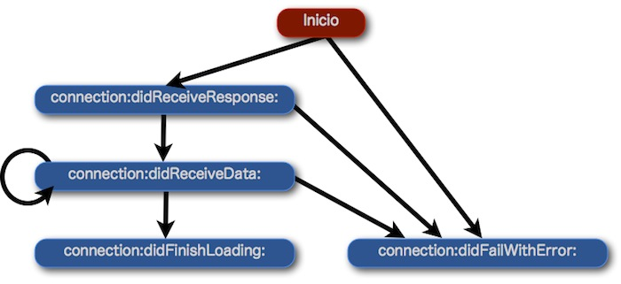

# Acceso a la red con iOS

Al igual que hemos visto para Android, en esta sesión veremos cómo acceder a la red desde las aplicaciones iOS.

## Conexión a URLs en iOS

Comenzaremos viendo cómo conectar con URLs desde aplicaciones iOS.

En la API de Cocoa Touch encontramos diferentes objetos para representar las URLs y las
conexiones a las mismas. Veremos que se trabaja con estos objetos de forma similar a las librerías para conectar a URLs de Java.

En primer lugar, tenemos la clase `NSURL` que representa una URL. Esta clase se inicializa con la cadena de la URL:

```objectivec
NSURL *theUrl = [NSURL URLWithString:@"http://www.ua.es"];
```

Si queremos hacer una petición a dicha URL, deberemos crear un objeto `NSURLRequest` a
partir de la URL anterior. De la petición podemos especificar también la política de caché a seguir, o el _timeout_ de la conexión. Si queremos modificar más datos de la petición, deberíamos utilizar un objeto `NSMutableURLRequest`.

```objectivec
NSURLRequest *theRequest = [NSURLRequest requestWithURL: theUrl];
```


Una vez creada la petición, podemos establecer la conexión con la URL y obtener el contenido que nos devuelva. Para hacer esto tenemos el objeto `NSURLConnection`. La forma más sencilla es utilizar el siguiente método:

```objectivec
NSURLResponse *theResponse;
NSError *theError;
NSData *datos = [NSURLConnection sendSynchronousRequest:theRequest
                                      returningResponse:&theResponse
                                                  error:&theError];
```

Con esto se realiza la conexión y nos devuelve los datos obtenidos encapsulados en un objeto de tipo `NSData`. La clase `NSData` se utiliza para encapsular datos binarios, y podemos leerlos directamente como array de bytes, o bien mediante otros tipos de objetos. Por ejemplo, podemos obtener los datos en forma de cadena mediante el inicializador
`initWithData:encoding:` de la clase `NSString`:

```objectivec
NSString *contenido = [[NSString alloc] initWithData: datos
                              encoding: NSASCIIStringEncoding];
```


Esta forma síncrona de realizar la conexión es sencilla, pero resulta poco adecuada debido a que dejará bloqueada la aplicación hasta que obtenga la respuesta, y en el caso de las operaciones de acceso a la red esto podría demorarse durante un tiempo considerable. Por lo tanto, lo recomendable será realizar la conexión siempre de forma asíncrona para evitar este problema, como veremos a continuación.


## Conexiones asíncronas en iOS

La forma habitual de realizar una conexión en iOS es de forma asíncrona. Para evitar bloqueos hay que realizar las conexiones de esta forma, fuera del hilo de eventos de nuestra aplicación. En iOS podemos realizar una conexión asíncrona de forma sencilla mediante la misma clase `NSURLConnection` vista anteriormente y objetos delegados.

Para ello deberemos utilizar el siguiente constructor de la clase `NSURLConnection`:

```objectivec
NSURLConnection *theConnection = [NSURLConnection
                connectionWithRequest: theRequest delegate: self];
```

Como podemos ver, en este caso a la conexión sólo le pasamos la petición y un objeto delegado. No hace falta pasarle ningún parámetro de salida para la respuesta HTTP ni para el error, ni esperamos que nos devuelva ningún contenido. Conforme vayan llegando datos desde el servidor se irá llamando a los métodos del delegado para proporcionarle la información recibida, pero nuestra aplicación seguirá funcionando durante ese tiempo. Es recomendable que al poner en marcha la conexión asíncrona, también activemos el indicador de actividad de red que aparece en la barra de estado, para que así el usuario sepa que se está realizando una conexión:

```objectivec
[UIApplication sharedApplication].networkActivityIndicatorVisible = YES;
```


El objeto delegado que especificamos al crear la conexión deberá implementar el protocolo `NSURLConnectionDataDelegate`. Algunos métodos destacados de este protocolo son:


* `connection:didReceiveResponse:` Se ejecuta una vez recibimos la respuesta del servidor.
En este momento ya tenemos las cabeceras de la respuesta, pero aun no su contenido.
* `connection:didReceiveData:` Se ejecuta cada vez que llega un nuevo bloque de datos del
servidor. La respuesta puede llegar troceada, por lo que cada vez que nos llegue un nuevo bloque deberemos añadirlo a la respuesta que tenemos hasta el momento.
* `connection:didFailWithError:` Se ejecuta en caso de que la conexión falle. Recibiremos el objeto de error correspondiente.
* `connectionDidFinishLoading:` Se ejecuta cuando la conexión ha terminado de recibir la
respuesta. En este momento sabremos que ya tenemos la respuesta completa, y podremos procesarla.



<!--

-->

Dado que, como hemos visto, al delegado le va llegando la respuesta por trozos, deberemos tener algún objeto al que añadirla. La respuesta se obtiene mediante un objeto de tipo `NSData`, por lo que lo más sencillo será crear en nuestro delegado una propiedad de tipo `NSMutableData` a la que podamos ir añadiendo cada fragmento recibido:

```objectivec
// En la declaración de propiedades
@property (nonatomic, strong) NSMutableData *downloadedData;
```

El mejor momento para inializar dicho objeto será cuando recibamos el mensaje de respuesta en `connection:didReceiveResponse:`, ya que aquí contaremos con cabeceras que nos dirán el tipo y la longitud del contenido de la respuesta. Conociendo la longitud, podemos inicializar el objeto `NSMutableData` con la capacidad adecuada:

```objectivec
-   (void)connection:(NSURLConnection *)connection
  didReceiveResponse:(NSURLResponse *)response
{
    if(response.expectedContentLength != NSURLResponseUnknownLength) {
        self.downloadedData = [NSMutableData dataWithCapacity:
                                       response.expectedContentLength];
    } else {
        self.downloadedData = [NSMutableData data];
    }
}
```

Tras esto, cada vez que nos llegue un nuevo fragmento de datos en `connection:didReceiveData:` lo añadiremos al objeto anterior:

```objectivec
- (void) connection:(NSURLConnection *)connection
     didReceiveData:(NSData *)data
{
    [self.downloadedData appendData: data];
}
```

Deberemos implementar también métodos que nos notifiquen cuando la respuesta se ha completado o cuando ha fallado la conexión. En cualquiera de los dos deberemos desactivar el indicador de actividad de red:

```objectivec
- (void) connection:(NSURLConnection *)connection
   didFailWithError:(NSError *)error
{
    [UIApplication
        sharedApplication].networkActivityIndicatorVisible = NO;
}

- (void) connectionDidFinishLoading:(NSURLConnection *)connection
{
    [UIApplication
        sharedApplication].networkActivityIndicatorVisible = NO;
    [self actualizarDatos];
}
```


## Comprobación de la conectividad en iOS

En iOS también podemos comprobar el tipo de conexión con el que contamos. De hecho,
uno de los ejemplos publicados en la documentación de Apple consiste precisamente en esto.
El ejemplo se llama _Reachability_ (se puede encontrar en la sección _Sample Code_
de la ayuda), y su código se puede utilizar directamente en nuestras aplicaciones. En el caso de iOS la comprobación no es tan sencilla como en Android, y se requiere el acceso a la conexión a bajo nivel. Por este motivo, lo más habitual entre los desarrolladores es incorporar el código del ejemplo _Reachability_.

Lo que necesitaremos incorporar al proyecto son los ficheros `Reachability.m` y `Reachability.h`. Además, también necesitaremos el _framework_ `SystemConfiguration` (deberemos añadirlo en la pantalla _Build Phases_ del _Target_).

```objectivec
internetReach = [[Reachability reachabilityForInternetConnection] retain];
[internetReach startNotifier];
if([internetReach currentReachabilityStatus] == ReachableViaWWAN) {
    // Tenemos conexión a Internet
}

wifiReach = [[Reachability reachabilityForLocalWiFi] retain];
[wifiReach startNotifier];
if([wifiReach currentReachabilityStatus] == ReachableViaWiFi) {
    // Estamos conectados mediante Wi-Fi
}
```

## Carga lazy de imágenes en iOS

En iOS contamos en la documentación con un ejemplo proporcionado por Apple que realiza esta función. Vamos a ver aquí como ejemplo una solución simplificada. La forma de trabajar será similar a la vista en el caso de Android. En el controlador de nuestra tabla podemos incluir un diccionario que contenga las imágenes que se estén descargando actualmente (equivale al mapa de tareas de descarga que teníamos en Android):

```objectivec
@property(nonatomic,strong) NSMutableDictionary *downloadingImages;
```

Conforme se vayan rellenando las celdas, se solicita la carga de las imágenes que no hayan sido cargadas todavía:

```objectivec
- (UITableViewCell *)tableView:(UITableView *)tableView
         cellForRowAtIndexPath:(NSIndexPath *)indexPath
{
  ...
  // Configure the cell.
  UAElemento *theItem = [self.listadoElementos
                                  objectAtIndex: indexPath.row];
  cell.textLabel.text = theItem.texto;

  if(theItem.imagen!=nil) {
      cell.imageView.image = theItem.imagen;
  } else if(theItem.urlImagen!=nil) {
      [self cargarImagen: theItem paraIndexPath: indexPath];
      cell.imageView.image = [UIImage imageNamed: @"Placeholder.png"];
  }

  return cell;
}
```

En caso de no contar todavía con la imagen, podemos poner una imagen temporal en la celda. La carga de imágenes se puede hacer de la siguiente forma:

```objectivec
- (void) cargarImagen: (UAElemento *) item
        paraIndexPath: (NSIndexPath *) indexPath
{
    if([self.downloadingImages objectForKey: indexPath] == nil) {

        UAImageDownloader *theDownloader = [[UAImageDownloader alloc]
          initWithUrl:item.urlImagen indexPath:indexPath delegate:self];
        [self.downloadingImages setObject: theDownloader
                                   forKey: indexPath];
        [theDownloader release];
    }
}
```

Cada descarga es gestionada por un objeto de la clase `UAImageDownloader`, que se encargará de gestionar la descarga asíncrona de la imagen cuya URL se le pasa en el inicializador, y estos objetos se introducen en el diccionario de descargas en progreso. Utilizamos el patrón delegado para que, una vez se haya finalizado la descarga, se nos proporcione la imagen obtenida. Definimos el protocolo para el delegado junto a la clase
`UAImagenDownloader`:

```objectivec
@class UAImageDownloader;

@protocol UAImageDownloaderDelegate

- (void)     imageDownloader: (UAImageDownloader *) downloader
   didFinishDownloadingImage: (UIImage *) image
                forIndexPath: (NSIndexPath *) indexPath;

@end

@interface UAImageDownloader : NSObject

- (id)initWithUrl: (NSString *) url
        indexPath: (NSIndexPath *)indexPath
         delegate: (id<UAImageDownloaderDelegate>) delegate;

@property(nonatomic,strong) NSString *url;
@property(nonatomic,strong) NSURLConnection *connection;
@property(nonatomic,strong) NSMutableData *data;
@property(nonatomic,strong) UIImage *image;

@property(nonatomic,unsafe_unretained)
                     id<UAImageDownloaderDelegate> delegate;
@property(nonatomic,unsafe_unretained) NSIndexPath *indexPath;

@end
```


Podemos implementar esta clase de la siguiente forma:

```objectivec
@implementation UAImageDownloader

// Sintetización de propiedades
...

- (id)initWithUrl: (NSString *) url
        indexPath: (NSIndexPath *)indexPath
         delegate: (id<UAImageDownloaderDelegate>) delegate;
{
    self = [super init];
    if (self) {
        NSURL *urlImagen = [NSURL URLWithString: url];
        NSURLRequest *theRequest =
            [NSURLRequest requestWithURL: urlImagen];
        NSURLConnection *theConnection =
            [NSURLConnection connectionWithRequest: theRequest
                                          delegate: self];

        self.url = url;
        self.indexPath = indexPath;
        self.delegate = delegate;

        self.connection = theConnection;
        self.data = [NSMutableData data];
    }

    return self;
}

- (void) connection:(NSURLConnection *)connection
     didReceiveData:(NSData *)data
{
    [self.data appendData: data];
}

- (void) connectionDidFinishLoading:(NSURLConnection *)connection
{
    UIImage *theImage = [UIImage imageWithData: self.data];
    self.image = theImage;

    [self.delegate imageDownloader: self
         didFinishDownloadingImage:self.image
                      forIndexPath:self.indexPath];
}

@end
```


La carga de la imagen se realiza de la misma forma que hemos visto anteriormente para descargar contenido de una URL. Una  vez finalizada la descarga se notifica al delegado. Utilizaremos el controlador de la tabla como delegado, que responderá de la siguiente forma cuando una imagen haya sido descargada:

```objectivec
- (void)      imageDownloader:(UAImageDownloader *)downloader
    didFinishDownloadingImage:(UIImage *)image
                 forIndexPath:(NSIndexPath *)indexPath {

    UAElemento *theItem =
        [self.listadoElementos objectAtIndex: indexPath.row];
    theItem.imagen = image;

    UITableViewCell *cell =
        [self.tableView cellForRowAtIndexPath: indexPath];
    cell.imageView.image = image;
}
```

Al recibir la imagen descargada la almacena en el item correspondiente, y la muestra en la tabla.

Tal como hemos visto en el caso de Android, podemos evitar que se descarguen las imágenes mientras se está haciendo  _scroll_ con un código como el siguiente:

```objectivec
- (UITableViewCell *)tableView:(UITableView *)tableView
         cellForRowAtIndexPath:(NSIndexPath *)indexPath
{
  ...
  // Configure the cell.
  UAElemento *theItem =
      [self.listadoElementos objectAtIndex: indexPath.row];
  cell.textLabel.text = theItem.texto;

  if(theItem.imagen!=nil) {
    cell.imageView.image = theItem.imagen;
  } else if(theItem.urlImagen!=nil) {
    if (self.tableView.dragging == NO &&
        self.tableView.decelerating == NO) {
      [self cargarImagen: theItem paraIndexPath: indexPath];
    }
    cell.imageView.image = [UIImage imageNamed: @"Placeholder.png"];
  }

  return cell;
}
```

Como podemos observar, impedimos la carga tanto si el usuario está arrastrando la lista, como si el _scroll_ se está realizando por la inercia de un movimiento anterior. Cuando el scroll pare deberemos hacer que carguen las imágenes de todas las celdas visibles en pantalla. Para ello deberemos implementar los siguientes métodos del protocolo `UIScrollViewDelegate`:

```objectivec

- (void)scrollViewDidEndDragging:(UIScrollView *)scrollView
                  willDecelerate:(BOOL)decelerate {
    if (!decelerate) {
        [self cargarImagenesEnPantalla];
    }
}

- (void)scrollViewDidEndDecelerating:(UIScrollView *)scrollView {
    [self cargarImagenesEnPantalla];
}

- (void)cargarImagenesEnPantalla {
    if ([self.listadoElementos count] > 0) {
        NSArray *visiblePaths =
            [self.tableView indexPathsForVisibleRows];
        for (NSIndexPath *indexPath in visiblePaths) {
            UAElemento *item =
                [self.listadoElementos objectAtIndex:indexPath.row];

            if (!item.imagen) {
                [self cargarImagen: theItem paraIndexPath: indexPath];
            }
        }
    }
```

Respecto a la memoria, si queremos evitar que las imágenes de una tabla puedan llenar la memoria, deberemos implementar el método `didReceiveMemoryWarning`. En él deberíamos detener las descargas pendientes, y liberar de memoria las imágenes que no sean necesarias. En este caso la liberación de los objetos la deberemos implementar manualmente nosotros.

Hemos visto que en ambos casos utilizamos un mapa o diccionario para almacenar todas las descargas que ya se han iniciado, y así evitar que se repita una descarga para la misma entrada de la tabla. Hemos utilizado la entrada de la tabla para indexar este mapa o diccionario. Sin embargo, en algunos casos podría ocurrir que múltiples entradas con la misma imagen (por ejemplo varios _tweets_ de una misma persona). Si es probable que distintas entradas tengan la misma imagen, sería recomendable utilizar la propia URL de la imagen para indexar el mapa o diccionario de descargas.

