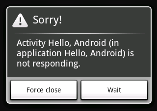

<!-- *********************************************************************** -->
# Acceso a la red con Android

En esta sesión vamos a ver cómo acceder a la red desde las aplicaciones Android. La forma habitual de acceder a servidores en Internet es mediante protocolo HTTP, mediante la URL en la que se localizan los recursos a los que queremos acceder.

Una consideración que debemos tener en cuenta es que las operaciones de red son operaciones lentas, y deberemos llevar cuidado para que no bloqueen la interfaz de nuestra aplicación. En esta sesión veremos cómo establecer este tipo de conexiones de forma correcta desde nuestras aplicaciones para móviles.


<!-- *********************************************************************** -->
## Conexión a URLs en Android

Vamos a comenzar viendo cómo conectar con URLs desde aplicaciones Android. Lo habitual será realizar una petición GET a una URL y obtener el documento que nos devuelve el servidor, por lo que las APIs de acceso a URLs nos facilitarán fundamentalmente esta operación. Sin embargo, como veremos más adelante también será posible realizar otras operaciones HTTP, como POST, PUT o DELETE, entre otras.

Como paso previo, para todas las conexiones a Internet en Android necesitaremos declarar los permisos en el `AndroidManifest.xml`, fuera de la etiqueta `application` tenemos que poner:

```xml
<uses-permission android:name="android.permission.INTERNET" />
```


Las conexiones por HTTP son las más comunes en las comunicaciones de red. En Android podemos utilizar la clase `HttpURLConnnection` en combinación con `URL`. Estas clases son las mismas que están presentes en Java SE, por lo que el acceso a URLs desde Android se puede hacer de la misma forma que en cualquier aplicación Java. Podemos ver información de las cabeceras de HTTP como se muestra a continuación (la información se añade a un `TextView` en el ejemplo):

```java
TextView tv = (TextView)findViewById(R.id.tvVisor);
tv.setText("Conexión http.\n\n");

try {
  URL url = new URL("http://www.ua.es");
  HttpURLConnection http = (HttpURLConnection)url.openConnection();

  tv.append("Cabeceras de http://www.ua.es:\n");
  tv.append(" longitud = "+http.getContentLength()+"\n");
  tv.append(" encoding = "+http.getContentEncoding()+"\n");
  tv.append(" tipo = "+http.getContentType()+"\n");
  tv.append(" response code = "+http.getResponseCode()+"\n");
  tv.append(" response message = "+http.getResponseMessage()+"\n");
  tv.append(" content = "+http.getContent().toString()+"\n");
} catch (MalformedURLException e) {
} catch (IOException e) {
}
```

Como se puede ver, podemos obtener desde la codificación del contenido hasta el código de respuesta de la petición. El método `getContent` no devuelve el contenido sino el método deconexión adecuado dependiendo del tipo de contenido. 

Es importante comprobar el código de respuesta con `getResponseCode`, el cual devolverá un entero que será igual a 200 si se puede acceder y descargar el contendio. En caso de que haya algún error devolverá un valor distinto a 200 correspondiente al código del error (https://en.wikipedia.org/wiki/List_of_HTTP_status_codes). Podemos comprobar esto haciendo simplemente: 

```java
if( http.getResponseCode() == HttpURLConnection.HTTP_OK ) {
    // Correcto! Ya podemos descargar el cotenido!
}
```


### Descargar contenido

La forma de descargar contenido es mediante un `InputStream` para leer o descargar los datos. Por lo que en primer lugar tendremos que crear el objeto `URL`, a continuación conectar usando la clase `HttpURLConnection` que hemos visto, después comprobaríamos si la URL es accesible o hay algún error, y por último descargaríamos el contenido usando el _stream_. 

A continuación se incluye una función de ejemplo que podríamos usar para descargar el contenido de una página Web: 


```java
// url = "http://www.ua.es";
public String descargarContendio( String strUrl )
{
    HttpURLConnection http = null;
    String content = null;

    try {
        URL url = new URL( strUrl );
        http = (HttpURLConnection)url.openConnection();

        if( http.getResponseCode() == HttpURLConnection.HTTP_OK ) {
            StringBuilder sb = new StringBuilder();
            BufferedReader reader = new BufferedReader(
                    new InputStreamReader( http.getInputStream() ));
            String line;
            while ((line = reader.readLine()) != null) {
                sb.append(line);
            }
            content = sb.toString();
            reader.close();
        }
    }
    catch(Exception e) {
        e.printStackTrace();
    }
    finally {
        if( http != null )
            http.disconnect();
    }
    return content;
}
```

Esta función recibe una cadena con la direccion URL de descarga y devuelve también una cadena con el contenido de la Web indicada. En caso de error se devolverá _null_. Además, como se puede ver, en el `finally` se cierra siempre la conexión HTTP.


### Descargar una imagen

En el ejemplo anterior descargabamos el contenido de una URL en formato de texto plano. Sin embargo, puede que queramos obtener otros formatos como por ejemplo una imagen. A continuación se incluye otra función de ejemplo para ilustrar como descargar una imagen desde una dirección URL: 

```
// url = "http://www.ua.es/imagenes/logoua.png";
public Bitmap descargarImagen(String strUrl) {
    HttpURLConnection http = null;
    Bitmap bitmap = null;

    try {
        URL url = new URL( strUrl );
        http = (HttpURLConnection)url.openConnection();

        if( http.getResponseCode() == HttpURLConnection.HTTP_OK ) 
            bitmap = BitmapFactory.decodeStream(http.getInputStream());
    }
    catch(Exception e) {
        e.printStackTrace();
    }
    finally {
        if( http != null )
            http.disconnect();
    }
    return bitmap;
}
```

En el caso general podemos leer sus propiedades de la cabecera, como su tipo MIME, codificación, longitud, etc., y por último descargarlo y asignarlo al tipo de fichero o dato adecuado. 


### Configuración

Podemos configurar algunos parámetros de la conexión, como el tiempo máximo de conexión o de descarga. En caso de que se supere alguno de estos umbrales se lanzará una excepción: 

```java
http.setReadTimeout( 10000 /*milliseconds*/ );
http.setConnectTimeout( 15000 /* milliseconds */ );
```
  
También podemos configurar otros valores de la cabecera de la petición, como la codificación o el _user-agent_: 
  
```java
http.setRequestProperty("User-Agent", "...");
http.setRequestProperty("Accept-Charset", "UTF-8");
http.setRequestProperty("Content-Type", "text/plain; charset=utf-8");
```

Además para evitar algunos problemas existentes al cerrar el flujo de datos de entrada en versiones de Android anteriores a la 2.2 (Froyo) podemos ejecutar el siguiente código: 

```java
private void disableConnectionReuseIfNecessary() {
   // Work around pre-Froyo bugs in HTTP connection reuse.
   if(Build.VERSION.SDK_INT < Build.VERSION_CODES.FROYO) 
     System.setProperty("http.keepAlive", "false");
}
```

Además se recomienda usar cada instancia de la clase `HttpURLConnection` para realizar una sola petición, ya que no es seguro crear varios hilos usando la misma instancia. 


<!-- *********************************************************************** -->
# Conexiones asíncronas en Android

En Internet no se puede asumir que ninguna operación de red vaya a ser rápida o vaya a durar un tiempo limitado (el limite lo establece, en todo caso, el timeout de la conexión). En los dispositivos móviles, todavía menos, ya que continuamente pierden calidad de la señal o pueden cambiar de Wifi a 3G sin preguntarnos, y perder conexiones o demorarlas durante el proceso.

Si una aplicación realiza una operación de red en el mismo hilo de la interfaz gráfica, el lapso de tiempo que dure la conexión, la interfaz gráfica dejará de responder. Este efecto es indeseable ya que el usuario no lo va a comprender, ni aunque la operación dure sólo un segundo. Es más, si la congelación dura más de dos segundos, es muy probable que el sistema operativo muestre el diálogo ANR, "Application not responding", invitando al usuario a matar la aplicación:



<!--

-->

Para evitar esto hay que realizar las conexiones de forma asíncrona, fuera del hilo de eventos de nuestra aplicación. En Android deberemos ser nosotros los que creemos otro hilo (`Thread`) de ejecución en el que se realice la conexión.

Durante el tiempo que dure la conexión la aplicación podrá seguir funcionando de forma normal, será decisión nuestra cómo interactuar con el usuario durante este tiempo. En algunos casos nos puede interesar mostrar una diálogo de progreso que evite que se pueda realizar ninguna otra acción durante el acceso. Sin embargo, esto es algo que debemos evitar siempre que sea posible, ya que el abuso de estos diálogos entorpecen el uso de la aplicación. Resulta más apropiado que la aplicación siga pudiendo ser utilizada por el usuario durante este tiempo, aunque siempre deberemos indicar de alguna forma que se está accediendo a la red.

<!--
Para ello normalmente contaremos en la barra de estado con un indicador de actividad de red, que deberemos activar al comenzar la conexión, y desactivar cuando se cierre. A continuación veremos cómo utilizar estos elementos en Android.


-->

<!--
 
-->

En Android, una forma sencilla de realizar una conexión de forma asíncrona es utilizar hilos, de la misma forma que en Java SE:

```java
ImageView imageView = (ImageView)findViewById(R.id.ImageView01);
new Thread(new Runnable() {
  public void run() {
    Drawable imagen = descargarImagen("http://...");
    // Desde aquí NO debo acceder a imageView
  }
}).start();
```

Pero hay un problema: tras cargar la imagen no puedo acceder a la interfaz gráfica porque la GUI de Android sigue un modelo de hilo único: sólo un hilo puede acceder a ella. Se puede solventar de varias maneras. Una es utilizar el método `View.post(Runnable)`.

```java
ImageView imageView = (ImageView)findViewById(R.id.ImageView01);
new Thread(new Runnable() {
  public void run() {
    Drawable imagen = descargarImagen("http://...");
    imageView.post(new Runnable() {
      public void run() {
        imageView.setDrawable(imagen);
      }
    });
  }
}).start();
```

Con esto lo que se hace es indicar un fragmento de código que debe ejecutarse en el hilo principal de eventos. En dicho fragmento de código se realizan los cambios necesarios en la interfaz. De esta forma, una vez la conexión ha terminado de cargar de forma asíncrona, desde el hilo de la conexión de introduce en el hilo principal de la UI el código que realice los cambios necesarios para mostrar el contenido obtenido.

Como alternativa, contamos también con el método `Activity.runOnUiThread(Runnable)` para ejecutar un bloque de código en el hilo de la UI:

```java
ImageView imageView = (ImageView)findViewById(R.id.ImageView01);
new Thread(new Runnable() {
  public void run() {
    Drawable imagen = descargarImagen("http://...");
    runOnUiThread(new Runnable() {
      public void run() {
        imageView.setDrawable(imagen);
      }
    });
  }
}).start();
```

Con esto podemos crear conexiones asíncronas cuyo resultado se muestre en la UI. Sin embargo, podemos observar que generan un código bastante complejo. Para solucionar este problema a partir de Android 1.5 se introduce la clase `AsyncTask` que nos permite implementar tareas asíncronas de forma más elegante.


<!-- *********************************************************************** -->
## AsyncTask

Se trata de una clase creada para facilitar el trabajo con hilos y con interfaz gráfica, y es muy útil para ir mostrando el progreso de una tarea larga, durante el desarrollo de ésta. Nos facilita la separación entre tarea secundaria e interfaz gráfica permitiéndonos solicitar un refresco del progreso desde la tarea secundaria, pero realizarlo en el hilo principal.

La estructura genérica para definir una tarea utilizando una _AsyncTask_ es la siguiente:

```java
private class MiTarea
        extends AsyncTask<ENTRADA, PROGRESO, SALIDA>
{
     @Override
     protected SALIDA doInBackground(ENTRADA... params) {
         ...
         publishProgress( PROGRESO );
         ...
         return SALIDA;
     }

     @Override
     protected void onPreExecute() {
        // ...
     }

     @Override
     protected void onProgressUpdate(PROGRESO... params) {
        // ...
     }

     @Override
     protected void onPostExecute(SALIDA result) {
	   // ...
     }

     @Override
     protected void onCancelled() {
        // ...
     }
}
```


Podemos observar que en la `AsyncTask` se especifican tres tipos utilizando genéricos:

```java
class MiTarea extends AsyncTask<ENTRADA, PROGRESO, SALIDA>
```

El primer tipo es el que se recibe como datos de entrada. Realmente se recibe un número variable de objetos del tipo indicado. Cuando ejecutamos la tarea con `execute` deberemos especificar como parámetros de la llamada dicha lista de objetos, que serán recibidos por el método `doInBackground`. Este método es el que implementará la tarea a realizar de forma asíncrona, y al ejecutarse en segundo plano deberemos tener en cuenta que **nunca** deberemos realizar cambios en la interfaz desde él. Cualquier cambio en la interfaz deberemos realizarlo en alguno de los demás métodos.

Por lo tando, el único método que se ejecuta en el segundo hilo de ejecución es el bucle del método `doInBackground(ENTRADA...)`. El resto de métodos se ejecutan en el mismo hilo que la interfaz gráfica y son los que tendremos que utilizar para actualizar los datos.


> La notación `(String... values)` indica que hay un número indeterminado de parámetros del tipo indicado, se accede a ellos con `values[0], values[1],` ..., y también podemos obtener el número de elementos con `values.length`. Esta notación forma parte de la sintaxis estándar de Java.

El segundo tipo de datos que se especifica en la declaración de la tarea es el tipo del progreso. Conforme avanza la tarea en segundo plano podemos publicar actualizaciones _visuales_ del progreso realizado. Hemos dicho que desde el método `doInBackground` no podemos modificar la interfaz, pero si que podemos llamar a `publishProgress` para solicitar que se actualice la información de progreso de la tarea, indicando como información de progreso una lista de elementos del tipo indicado como tipo de progreso. Tras hacer esto se ejecutará el método `onProgressUpdate` de la tarea, que recibirá la información que pasamos como parámetro. Este método si que se ejecuta dentro del hilo de la interfaz, por lo que podremos actualizar la visualización del progreso dentro de él, en función de la información recibida. Es importante entender que la ejecución de `onProgressUpdate(...)` no tiene por qué ocurrir inmediatamente después de la petición `publishProgress(...)`, o puede incluso no llegar a ocurrir.

Por último, el tercer tipo corresponde al resultado de la operación. Es el tipo que devolverá `doInBackground` tras ejecutarse, y lo recibirá `onPostExecute` como parámetro. Este último método podrá actualizar la interfaz con la información resultante de la ejecución en segundo plano.

También contamos con el método `onPreExecute`, que se ejecutará justo antes de comenzar la tarea en segundo plano, y `onCancelled`, que se ejecutará si la tarea es cancelada (una tarea se puede cancelar llamando a su método `cancel`, y en tal caso no llegará a ejecutarse `onPostExecute`). Estos métodos nos van a resultar de gran utilidad para mostrar un indicador de actividad del proceso de descarga.

Si por ejemplo tenemos una tarea con la definición `class MiTarea extends AsyncTask<String, Void, String>`, estaremos indicando que al realizar la llamada le pondemos pasar cadenas, que como tipo de datos de progreso no se va a utilizar nada, y que como resultado se devolverá una cadena. Para realizar una llamada a una tarea de este tipo tendremos que hacer:

```java
new MiTarea().execute("entrada");

// O también podremos pasar varios valores, de la forma:
new MiTarea().execute("entrada1", "entrada2", "entrada3");
```

Por ejemplo, una tarea sencilla para descargar un contenido podría ser:


```java
private class DownloadTask extends AsyncTask<String, Void, String>
{
    @Override
    protected String doInBackground(String... urls)
    {
        // Llamada al método de descarga de contenido que
        // se ejecutará en segundo plano
        return descargarContenido( urls[0] );
    }

    @Override
    protected void onPreExecute()
    {
        // Inicializar campos y valores necesarios
    }

    @Override
    protected void onPostExecute(String contenido)
    {
        // Mostrar el resultado en un TextView
        mTextView.setText( contenido );
    }

    @Override
    protected void onCancelled()
    {
        // Tarea cancelada, lo dejamos como estaba
    }
}
```


Otro ejemplo un poco más complejo, creamos una tarea asíncrona para descargar una lista de imágenes.
En este caso recibirá como entrada una lista de _urls_ de las imágenes a descargar, realizará la
descarga de todas ellas almacenándolas en una lista de _Drawables_ y una vez finalizado las mostrará.


```java
TextView textView;
ImageView[] imageView;

public void bajarImagenes(){
	textView = (TextView)findViewById(R.id.TextView01);
	imageView[0] = (ImageView)findViewById(R.id.ImageView01);
	imageView[1] = (ImageView)findViewById(R.id.ImageView02);
	imageView[2] = (ImageView)findViewById(R.id.ImageView03);
	imageView[3] = (ImageView)findViewById(R.id.ImageView04);

	new BajarImagenesTask().execute(
		"http://a.com/1.png",
		"http://a.com/2.png",
		"http://a.com/3.png",
		"http://a.com/4.png");
}

private class BajarImagenesTask extends
                        AsyncTask<String, Integer, List<Drawable>>
{
     @Override
     protected List<Drawable> doInBackground(String... urls) {
         ArrayList<Drawable> imagenes = new ArrayList<Drawable>();
         for(int i=0;i<urls.length; i++) {
           imagenes.add( descargarImagen(urls[i]) );
           publishProgress(i);
         }
         return imagenes;
     }

     @Override
     protected void onPreExecute() {
       // Mostrar indicador descarga
       textView.setText("Comenzando la descarga ...");
     }

     @Override
     protected void onProgressUpdate(Integer... values) {
       textView.setText(values[0] + " imágenes descargadas...");
     }

     @Override
     protected void onPostExecute(List<Drawable> result) {
	   // Ocultar indicador descarga
       textView.setText("Descarga finalizada");

       for(int i=0; i<result.length; i++){
         imageView[i].setDrawable(result.getItemAt(i));
       }
     }

     @Override
     protected void onCancelled() {
       // Ocultar indicador descarga
     }
}
```


<!-- *********************************************************************** -->
<!--
## Indicador de actividad

Indicador de actividad en la barra de estado.

Este indicador se activa y desactiva mediante el siguiente método de la actividad:

```java
// Mostrar indicador de actividad en la barra de estado
setProgressBarIndeterminateVisibility(true);

// Ocultar indicador de actividad en la barra de estado
setProgressBarIndeterminateVisibility(false);
```

Lo habitual será activarlo en `onPreExecute`, y desactivarlo tanto en `onPostExecute` como en `onCancelled`. Este indicador informa al usuario de que la aplicación está trabajando, pero no da información concreta sobre el progreso (por eso se llama _Indeterminate_). Para poder utilizar este tipo de progreso, al crear la actividad deberemos haberlo solicitado:

```java
@Override
protected void onCreate(Bundle savedInstanceState) {
    super.onCreate(savedInstanceState);
    getWindow().requestFeature(Window.FEATURE_INDETERMINATE_PROGRESS);
    ...
}
```
Es importante solicitar esta característica antes de hacer la llamada al `setContentView` y al constructor del padre `super.onCreate`.

También contamos con una barra de progreso en la barra de estado, que podemos activar con `setProgressBarVisibility`, habiéndola solicitado previamente con:

```java
@Override
protected void onCreate(Bundle savedInstanceState) {
    super.onCreate(savedInstanceState);
    getWindow().requestFeature(Window.FEATURE_PROGRESS);
    ...
}
```

En este caso, deberemos modificar el progreso mientras se realiza la carga. El progreso se indicará mediante un valor de 0 a 10000, y se actualizará mediante el método `setProgress(int)` de la actividad. Podemos llamar a este método desde `onProgressUpdate`, tal como hemos visto anteriormente:

```java
@Override
protected void onProgressUpdate(Integer... values) {
    setProgress(values[0] * 10000 / numero_imagenes);
}
```

-->


<!-- *********************************************************************** -->
# Comprobación de la conectividad en Android

En algunas aplicaciones puede convenir comprobar el estado de red. El estado de red no es garantía de que la conexión vaya a funcionar, pero sí que puede prevenirnos de intentar establecer una conexión que no vaya a funcionar. Por ejemplo, hay aplicaciones que requieren el uso de la WIFI para garantizar mayor velocidad.

Cuando desarrollemos una aplicación que acceda a la red deberemos tener en cuenta que el usuario normalmente contará con una tarifa de datos limitada, en la que una vez superado el límite o bien se le tarificará por consumo, o bien se le reducirá la velocidad de conexión. Por este motivo, deberemos llevar especial cuidado con las operaciones de red, y velar al máximo por reducir el consumo de datos del usuario.

En ciertas ocasiones esto puede implicar limitar ciertas funcionalidades de la aplicación a las zonas en las que contemos con conexión Wi-Fi, o por lo menos avisar al usuario en caso de que solicite una de estas operaciones mediante 3G, y darle la oportunidad de cancelarla.

En primer lugar para comprobar el estado de la red tenemos que solicitar los permisos en el Manifest, fuera de la sección `application`: 

```xml
<uses-permission android:name="android.permission.ACCESS_NETWORK_STATE"/>
```

A continuación se muestra cómo usar el `ConnectivityManager` para comprobar el estado de red en dispositivos Android.

```java
boolean checkStatus(Context ctx) {
    ConnectivityManager cm = (ConnectivityManager)
        ctx.getSystemService(Context.CONNECTIVITY_SERVICE);

    NetworkInfo i = cm.getActiveNetworkInfo();

    if (i == null || !i.isAvailable() || !i.isConnected())
        return false;  // Inteerneer!!
        
    return true;
}
```


Con la función anterior podremos comprobar si el dispositivo tiene conexión o no, pero además podemos saber el tipo de conexión que está usando mediante la función `getType`, por ejemplo:

```java
ConnectivityManager cm = (ConnectivityManager)
        ctx.getSystemService(Context.CONNECTIVITY_SERVICE);

NetworkInfo i = cm.getActiveNetworkInfo();

if( i.getType() == ConnectivityManager.TYPE_MOBILE )
    // Conectado por datos
else if( i.getType() == ConnectivityManager.TYPE_WIFI )
    // Conectado a una red wifi
```


<!--
DEPRECATED

El `ConnectivityManager` también puede utilizarse para controlar el estado de red, o bien estableciendo una preferencia pero permitiéndole usar el tipo de conectividad que realmente está disponible,

```java
cm.setNetworkPreference(NetworkPreference.PREFER_WIFI);
```

o bien pidiéndole explícitamente que se desconecte de la red móvil y se conecte a la red WiFi:

```java
cm.setRadio(NetworkType.MOBILE,false);
cm.setRadio(NetworkType.WIFI,true);
```

-->


<!-- *********************************************************************** -->
# Carga lazy de imágenes en Android

Otro caso típico en el trabajo con HTTP es el de cargar una lista de imágenes para almacenarlas o bien mostrarlas. Lo más habitual es tener un componente de tipo lista o tabla, en el que para cada elemento se muestra una imagen como icono. En una primera aproximación, tal como hemos visto en alguno de los ejemplo anteriores, podríamos cargar todas las imágenes al cargar los datos de la lista, y tras ello actualizar la interfaz. Sin embargo, esto tiene serios problemas. El primero de ellos es el tiempo que pueden tardar en cargarse todas las imágenes de una lista. Podría dejar al usuario en espera durante demasiado tiempo. Por otro lado, estaríamos cargando todas las imágenes, cuando es posible que el usuario no esté interesado en recorrer toda la lista, sino sólo sus primeros elementos. En este caso estaríamos malgastando la tarifa de datos del usuario de forma innecesaria.

Un mejor enfoque para la carga de imágenes de listas es hacerlo de forma _lazy_, es decir, cargar la imagen de una fila sólo cuando dicha fila se muestre en pantalla. Además, cada imagen se cargará de forma asíncrona, mediante su propio hilo en segundo plano, y cuando la carga se haya completado se actualizará la interfaz. El efecto que esto producirá será que veremos como van apareciendo las imágenes una a una, conforme se completa su carga.

Como mejora, también se suele hacer que la carga _lazy_ sólo se produzca en el caso en el que no estemos haciendo _scroll_ en la lista. Es posible que el usuario esté buscando un determinado elemento en una larga lista, o que esté interesado en los últimos elementos. En tal caso, mientras hace _scroll_ rápidamente para llegar al elemento buscado será recomendable evitar que las imágenes por las que pasemos se pongan en la lista de carga, ya que en principio el usuario no parece interesado en ellas. Esto se puede implementar de forma sencilla atendiendo a los eventos del _scroll_, y añadiendo las imágenes a la cola de descargas sólo cuando se encuentre detenido.

Según la aplicación, también podemos guardar las imágenes de forma persistente, de forma que en próximas visitas no sea necesario volver a descargarlas. En caso de tener un conjunto acotado de elementos a los que accedamos frecuentemente, puede ser recomendable almacenarlos en una base de datos propia, junto con su imagen. De no ser así, podemos almacenar las imágenes en una caché temporal con `Context.getCacheDir()`.


<!-- *********************************** -->
## Carga _lazy_ en Android

En Android podemos implementar la carga _lazy_ de imágenes en el mismo adaptador que
se encargue de rellenar la lista de datos. Por ejemplo, imaginemos el siguiente adaptador
que obtiene los datos a partir de un _array_ de elementos de tipo `Elemento` (con los campos `texto`, `imagen`, y `urlImagen`):

```java
public class ImagenAdapter extends BaseAdapter
{
    private List<Elemento> mList;
    private Context mContext;

    public PastaAdapter(Context context, List<Elemento> objects) {
        mContext = context;
        mList = objects;
    }

    @Override
    public int getCount()  {  return mList.size(); }

    @Override
    public Object getItem(int position) { return mList.get(position); }

    @Override
    public long getItemId(int position) { return position;  }

    @Override
    public View getView(int position, View convertView, ViewGroup parent)
    {
        if(convertView == null) {
          LayoutInflater li = (LayoutInflater) this.getContext()
                         .getSystemService(Context.LAYOUT_INFLATER_SERVICE);
          convertView = li.inflate(R.layout.item, null);
        }

        TextView tvTexto = (TextView) convertView.findViewById(R.id.tvTitulo);
        ImageView ivIcono = (ImageView) convertView
                                         .findViewById(R.id.ivIcono);

        Elemento elemento = mList.get(position);
        tvTexto.setText(elemento.getTexto());

        if(elemento.getImagen()!=null) {
          ivIcono.setImageBitmap(elemento.getImagen());
        }

        return convertView;
    }

}
```


El _layout_ de cada fila se puede definir de la siguiente forma:

```xml
<LinearLayout
  xmlns:android="http://schemas.android.com/apk/res/android"
  android:layout_width="match_parent"
  android:layout_height="match_parent"
  android:orientation="horizontal">
    <ImageView android:layout_height="wrap_content"
               android:layout_width="wrap_content"
               android:src="@drawable/icon"
               android:id="@+id/ivIcono"/>
    <TextView android:layout_height="wrap_content"
              android:layout_width="wrap_content"
              android:id="@+id/tvTitulo"/>
</LinearLayout>
```

El adaptador del ejemplo anterior funcionará siempre que las imágenes se encuentren ya cargadas en memoria, como se puede ver en el método `getView` son obtenidas mediante el método `getImagen()` del objeto `Elemento` y en caso de no estar cargadas no se mostraría nada. Al mostrarse este listado se producirá el siguiente efecto: en primer lugar no aparecerá nada ya que las imágenes se estarán descargando y el usuario tendrá que esperar, una vez obtenidas aparecerá el listado con todas las imágenes a la vez.

Sin embargo, si queremos implementar carga _lazy_ deberemos hacer que al rellenar cada fila (método `getView`), en caso de no estar todavía cargada la imagen, ponga en marcha una `AsyncTask` que se encargue de la descarga individual de la imagen. Para evitar que se pueda crear más de una tarea de descarga para un mismo elemento, crearemos un mapa en memoria con todas las imágenes que se están cargando actualmente, y sólo comenzaremos una carga si no hay ninguna en marcha para el elemento indicado:


```java
public class ImagenAdapter extends BaseAdapter
{
  private List<Elemento> mList;
  private Context mContext;
  // Mapa de tareas de carga en proceso
  private Map<Elemento, CargarImagenTask> mImagenesCargando;

  public ImagenAdapter(Context context, List<Elemento> objects) {
    mContext = context;
    mList = objects;
    mImagenesCargando = new HashMap<Elemento, CargarImagenTask>();
  }

  // ...

  @Override
  public View getView(int position, View convertView, ViewGroup parent) {
    //...

    if(elemento.getImagen()!=null) {
      ivIcono.setImageBitmap(elemento.getImagen());
    } else {
      // Ponemos esta imagen de momento
      ivIcono.setImageResource(R.drawable.icon);

      // Si la imagen no está descargando...
      if(mImagenesCargando.get(elemento)==null) {
          CargarImagenTask task = new CargarImagenTask();
          mImagenesCargando.put(elemento, task);
          task.execute(elemento, ivIcono);
      }
    }

    return convertView;
  }

  class CargarImagenTask extends AsyncTask<Object, Integer, Bitmap>
  {
    Elemento elemento;
    ImageView view;

    @Override
    protected Bitmap doInBackground(Object... params) {
      HttpURLConnection http = null;
      Bitmap bitmap = null;
      
      this.elemento = (Elemento)params[0];
      this.view = (ImageView)params[1];

      try {
        URL url = new URL( this.elemento.getUrlImagen() );
        http = (HttpURLConnection)url.openConnection();

        if( http.getResponseCode() == HttpURLConnection.HTTP_OK )
           bitmap = BitmapFactory.decodeStream(http.getInputStream());
      }
      catch(Exception e) {
        e.printStackTrace();
      }
      finally {
        if( http != null )
            http.disconnect();
      }
      return bitmap;
    }

    @Override
    protected void onPostExecute(Bitmap result) {
      if(result!=null) {
        this.elemento.setImagen(result);
        this.view.setImageBitmap(result);
      }
    }
  }
}
```


<!-- *********************************** -->
## Mejora: Carga _lazy_ solo cuando no se hace _scroll_

Como mejora se puede hacer que las imágenes solo se descarguen si no se está haciendo _scroll_ en la lista. Para ello podemos hacer que el adaptador implemente un `AbsListView.OnScrollListener`, y registrarlo como oyente de la lista (esto lo tendremos que hacer desde la actividad que contiene a la lista):

```java
// En el constructor de la actividad
miListView.setOnScrollListener(adaptador)
```

En el adaptador podemos crear una variable que indique si está ocupado o no haciendo _scroll_, y que sólo descargue imágenes cuando no esté ocupado. Cuando pare el _scroll_ recargaremos los datos de la lista (`notifyDataSetChanged()`) para que carguen todas las imágenes que haya actualmente en pantalla:

```java
public class ImagenAdapter extends BaseAdapter
                           implements OnScrollListener {
  boolean mBusy = false;

  //...

  @Override
  public View getView(int position, View convertView, ViewGroup parent) {
    //...

    if(elemento.getImagen()!=null) {
      ivIcono.setImageBitmap(elemento.getImagen());
    } else {
      // Ponemos esta imagen de momento
      ivIcono.setImageResource(R.drawable.icon);

      // Si la imagen no está cargada y no se está haciendo SCROLL...
      if(mImagenesCargando.get(elemento)==null && !mBusy) {
          CargarImagenTask task = new CargarImagenTask();
          mImagenesCargando.put(elemento, task);
          task.execute(elemento, ivIcono);
      }
    }

    return convertView;
  }

  public void onScroll(AbsListView view, int firstVisibleItem,
                       int visibleItemCount, int totalItemCount) {
  }

  public void onScrollStateChanged(AbsListView view, int scrollState) {
    switch(scrollState) {
      case OnScrollListener.SCROLL_STATE_IDLE:
        mBusy = false;
        notifyDataSetChanged();
        break;
      case OnScrollListener.SCROLL_STATE_TOUCH_SCROLL:
        mBusy = true;
        break;
      case OnScrollListener.SCROLL_STATE_FLING:
        mBusy = true;
        break;
    }
  }
}
```


<!-- *********************************** -->
## Referencias _débiles_ a elementos

Si la tabla tuviese una gran cantidad de elementos y cargásemos las imágenes de todos ellos, podríamos correr el riesgo de quedarnos sin memoria. Una posible forma de evitar este problema es utilizar la clase `SoftReference`. Con ella podemos crear una referencia débil a datos, de forma que si Java se queda sin memoria será eliminada automáticamente de ella. Esto es bastante adecuado para las imágenes de una lista, ya que si nos quedamos sin memoria será conveniente que se liberen y se vuelvan a cargar cuando sea necesario. Podemos crear una referencia débil de la siguiente forma:

```java
public class Elemento {
  ...

  SoftReference<Bitmap> imagen;

  ...

}
```

Para obtener la imagen referenciada débilmente deberemos llamar al método `get()` del
objeto `SoftReference`:

```java
if(elemento.getImagen().get()!=null) {
  ivIcono.setImageBitmap(elemento.getImagen().get());
} else {
  ...
}
```

Para crear una nueva referencia débil a una imagen deberemos utilizar el constructor de `SoftReference` a partir de la imagen que vamos a referenciar:

```java
protected void onPostExecute(Bitmap result) {
  if(result!=null) {
    this.elemento.setImagen(new SoftReference<Bitmap>(result));
    this.view.setImageBitmap(result);
  }
}
```

Cuando el dispositivo se esté quedando sin memoria podrá liberar automáticamente el contenido de todos los objetos `SoftReference` y sus referencias se pondrán a `null`.


<!-- *********************************************************************** -->
<!-- *********************************************************************** -->
<!-- *********************************************************************** -->
<!-- *********************************************************************** -->


<!-- *********************************************************************** -->
# Ejercicios


<!-- *********************************************************************** -->
## Ejercicio 1 - Visor de HTML (1 punto)

En este ejercicio vamos a hacer una aplicación que nos permita visualizar el código HTML de la URL que indiquemos. Para esto tenéis que crear un nuevo proyecto Android llamado `LectorHtml` con una sola actividad. En las plantillas de los ejercicios podéis encontrar el layout para la interfaz de esta actividad (fichero `layout_lector_html.xml`). Esta plantilla contiene una pantalla con un cuadro de edición de texto para introducir la URL, un botón para cargar la URL, y un visor de texto donde deberemos mostrar los resultados obtenidos cuando se pulse el botón. Se pide:

_a)_ Implementar el código necesario para que cuando se pulse el botón se realice una conexión a la URL indicada, se obtenga el resultado como texto y se muestre en el visor de texto (por el momento podemos realizar la conexión de forma **síncrona**).

> IMPORTANTE: en primer lugar debemos añadir los permisos necesarios a `AndroidManifest.xml` (de no hacer esto nos parecerá que el emulador no tiene acceso a la red).

> A partir de la versión 3.0 de Android aparecerá una excepción del tipo `android.os.NetworkOnMainThreadException` indicando que habéis realizado la conexión dentro del hilo principal.


_b)_ Modificar el código anterior para que la conexión se realice de forma **asíncrona**. Para esto tendréis que crear una tarea asíncrona usando una `AsyncTask` (revisar teoría) e iniciarla en el evento del botón (en lugar de llamar directamente al método que realiza la conexión). La tarea asíncrona tendrá que llamar al método de descarga en el `doInBackground` y posteriormente mostrar el resultado obtenido desde su método `onPostExecute`.

> Pista: Los tipos de datos con los que tenéis que crear la tarea asíncrona son: `<String, Void, String>`, es decir, tendrá un String de entrada (la URL a cargar), como segundo parámetro ponemos Void ya que no vamos a mostrar el progreso y como último parámetro usamos String para devolver el resultado.


_c)_ Haz que el botón se deshabilite mientras dura la descarga. Recuerda que la tarea de descarga podría terminar tanto de forma normal como por ser cancelada.

> Ayuda: Estas acciones las tenemos que realizar en la tarea asíncrona, en los métodos `onPreExecute`, `onPostExecute` o en `onCancelled`.

<!-- Mostrar en la barra de estado un indicador de actividad de red mientras se descarga el HTML.  -->


<!-- *********************************************************************** -->
## Ejercicio 2 - Carga _lazy_ de imágenes (2 punto)

En este ejercicio vamos a crear una nueva aplicación llamada "PastaList" que mostrará un listado de los distintos tipos de pasta con una imagen y el nombre de la variedad. Al pulsar sobre un elemento se tendrá que abrir una actividad secundaria con una vista detalle de dicho elemento.

Los pasos a seguir son los siguientes:

* En primer lugar crea una nueva aplicación llamada "PastaList".
* Añade al proyecto el contenido proporcionado en las plantillas: `PastaList.java`, `PastaAdapter.java`, `PastaLoader.java` `Pasta.java` y `list_item.xml` (cada uno en la carpeta correspondiente).
* Cambia el nombre del `package` de los ficheros Java de las plantillas por el de tu aplicación.
* Edita el _layout_ de la actividad principal para que contenga solamente un `ListView`.
* Edita la actividad principal para:
   * Obtener una referencia al `ListView` del _layout_.
   * Crear una instancia de `PastaAdapter.java` con el contexto y la lista de pasta obtenida desde `PastaList.java`.
   * Asignar la instancia del adapter al _listview_.
   * Hacer que al pulsar sobre un elemento del listado se habrá una nueva actividad para ver el tipo de pasta en detalle. Tendremos que pasarle en el _intent_ los datos del elemento, para que desde la otra actividad los pueda recoger y mostrar.
* Crea la actividad para mostrar la vista detalle. En su _layout_ añade un _ImageView_ (que ocupe todo el ancho y tenga 250dp de alto) y un _TextView_ debajo para mostrar el nombre. En la actividad asociada recoge los datos del _intent_ de llamada que se le pasan desde la actividad principal (nombre y url) y asigna el nombre al campo apropiado del _layout_.

Con esto ya tenemos todos los elementos conectados, si lo ejecutamos nos tendría que mostrar el listado con un icono por defecto para cada elemento y los distintos nombres de tipos de pasta, y al pulsar sobre un elemento se tendría que abrir la vista detalle mostrando el icono por defecto y el nombre.

Ahora solamente nos falta completar la descarga de imágenes, la cual la vamos a implementar de forma _lazy_, es decir, deberemos cargarlas conforme se solicita que se muestren las celdas en pantalla, no antes. La carga deberá realizarse en segundo plano.

Vamos a empezar por la vista detalle:

* En la actividad de la vista detalle crea una instancia de la clase `PastaLoader.java` para que descargue la imagen. Para llamar a esta clase lo tendremos que hacer de la forma: `new PastaLoader().execute( pastaItem, ivImageView );`, donde:
  * `pastaItem` es una instancia de la clase `Pasta` de las plantillas.
  * `ivImageView` es el campo _ImageView_ del _layout_ donde se ha de colocar la imagen.
* Por último, completa el método `prv_imageLoader` de `PastaLoader` para que descargue la imagen que se le pasa por parámetro y la devuelva como un Bitmap.

Si lo probamos nos tendría que mostrar la imagen de la vista detalle. 

> Pista: ¿No descarga la imagen y te salta una excepción? ¿Te falta solicitar algún permiso en el Manifest?


Ahora vamos a completar la descarga _lazy_ de la lista principal, para esto tenéis que editar la clase `PastaAdapter` para completar la descarga de imágenes añadiendo un mapa de las descargas activas y realizando la llamada a _PastaLoader_ solamente para las imágenes que no estén ya cargadas.

> Nota: La clase `PastaLoader` ya guarda automáticamente la imagen descargada en la instancia del objeto tipo `Pasta` que se le pasa como primer parámetro en la llamada. Para comprobar si un elemento tipo `Pasta` tiene una imagen ya cargada simplemente tendréis que hacer: `pasta.getBitmap() != null`.

De forma opcional puedes implementar también las siguientes funcionalidades:

* No descargar imágenes mientras se hace _scroll_.
* Permitir que las imágenes se eliminen en condiciones de baja memoria.


