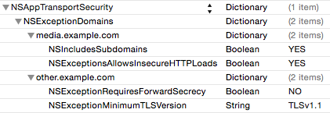

# Acceso a la red en iOS

Al igual que hemos visto para Android, en esta sesión veremos cómo acceder a la red desde las aplicaciones iOS.

## Conexión a URLs en iOS

Comenzaremos viendo cómo conectarnos con URLs.

En el API de Cocoa Touch encontramos diferentes objetos para representar las URLs y las conexiones a las mismas. Veremos que se trabaja con estos objetos de forma similar a las librerías de Java para conectarnos con URLs.

Para crear la conexión, **antes de iOS7** teníamos la clase `NSURLConnection`, que permitía hacer las conexiones de forma síncrona o asíncrona. Sin embargo, la gestión de estas conexiones dejaba bastantes aspectos del código al programador, lo que daba lugar a problemas de seguridad. Para simplificar el código, la mayoría de desarrolladores empezaron a usar clases alternativas de terceros como _AFNetworking_, hasta que Apple decidió añadir una clase integrada en iOS que hiciera algo parecido mejorando así la gestión de las conexiones. Esta clase, que es la que debe usarse siempre en iOS cuando trabajemos con el interfaz nativo, es `URLSession`.

Podemos crear una nueva conexión del siguiente modo:

```swift
// Creamos la configuración
let config = URLSessionConfiguration.default

// Se pueden hacer cambios en la configuración, por ejemplo:
config.allowsCellularAccess = false

// Creamos la sesión con esta configuración
let session = URLSession(configuration: config)
```

La configuración de la sesión puede ser de tres tipos:

* `default`: Usa una caché persistente en disco y guarda las credenciales en el _keychain_. Es la que se suele usar en la mayoría de casos.

* `ephemeral`: No se guarda ningún dato en disco. Toda la caché, credenciales y demás datos se guardan en la RAM y se vinculan a la sesión. Cuando la sesión termina, estos datos se eliminan.

* `background`: Son similares a las sesiones `default`, pero usan un proceso separado para gestionar toda la transferencia de datos. Se emplea cuando queremos descargar datos mientras la aplicación está suspendida.

Como alternativa, si necesitamos algo sencillo en iOS podemos usar también una sesión _singleton_ que está creada por defecto y que se llama _shared_:

```swift
let session = URLSession.shared
```

La sesión compartida puede usarse desde cualquier punto de nuestra aplicación, y es interesante cuando nuestras peticiones son sencillas y no requieren cambios en la configuración, ya que la sesión compartida no puede modificarse.

Una vez tenemos creada la sesión podemos realizar una tarea mediante una petición. Para ello primero tenemos que crear un objeto de la clase `URL` que representa y que se inicializa con la cadena de la dirección correspondiente:

```swift
let theUrl = URL(string: "http://www.apple.com")
```

Podemos usar directamente la URL, pero en general es conveniente filtrar la cadena por si contiene caracteres no permitidos:

```swift
let url = "http://www.apple.com"
if let encodedString = url?.addingPercentEncoding( withAllowedCharacters: .urlQueryAllowed) {
    let encodedUrl = URL(string: encodedString)!
    // ...
}        
```

Para hacer una petición a dicha URL, deberemos crear un objeto `URLRequest` a partir de la misma. En la creación de la petición podemos especificar también la política de caché a seguir, o el _timeout_ de la conexión.

```swift
let request = URLRequest(url: encodedUrl)
```

Si queremos modificar más datos de la petición, deberíamos utilizar un objeto `NSMutableURLRequest` en su lugar. En nuestra petición podemos añadir valores como el tipo de método (GET,POST,etc.), como veremos en la parte de servicios REST.

Una vez tenemos la petición y la sesión configurada, podemos lanzar la consulta mediante una tarea:

<!--- Buena ayuda actualizada: https://cocoacasts.com/networking-with-urlsession-meet-the-urlsession-family/ --->

```swift
session.dataTask(with: request, completionHandler: {
    data, response, error in

    // La respuesta del servidor se recibe en este punto.
    // Se guardan los datos recibidos (data), la respuesta (response) y si ha habido algún error

    if let error = error {
        print(error.localizedDescription)
    }
    else {
        let res = response as! HTTPURLResponse

        if res.statusCode == 200 {
            DispatchQueue.main.async { // Esperamos a que terminen de recibirse todos los datos
                // Guardamos los datos en un string con formato ASCII o UTF8
                let contents = String(data: data!, encoding: .ascii)!
                print (contents)
            }
        }
        else {
            print("Received status code: \(res.statusCode)")
        }
    }
}).resume() // Con esta instrucción lanzamos la petición asíncrona
```

Este método lanza una petición asíncrona y recibe la respuesta del servidor, los datos, y un error si se ha producido algún problema. Además de `dataTask(with:request)`, podemos seleccionar otros tipos de tareas:

* `dataTask(with:request)`, `dataTask(with:url)`: Se usan para peticiones puntuales al servidor. `dataTask(with: url)` es similar a `dataTask(with:request)` pero no necesita una `URLRequest` sino sólo una `URL`, y por tanto puede usarse para conexiones sencillas que no requieran cabeceras o configuraciones específicas.

* `downloadTask(with:request)`, `downloadTask(with:url)`: Descargan datos en forma de fichero y soportan descargas en segundo plano cuando la aplicación no se está ejecutando. Se usan por ejemplo cuando queremos descargar una serie de imágenes y mostrarlas en una tabla.

* `uploadTask(with:request)`, `uploadTask(with:url)`: Como la anterior, pero para subir ficheros al servidor en lugar de descargarlos.

Vamos a ver un ejemplo completo de código, con una clase propia `Connection` que usaremos para gestionar las conexiones. Esta clase asumirá que la sesión y la petición están ya creadas. Implementar esto en una clase separada nos va a permitir que nuestra app pueda crear conexiones desde distintos controladores de forma más limpia. El fichero `Connection.swift` contiene lo siguiente:

```swift
import Foundation

// Protocolo de Connection
protocol ConnectionDelegate {
    func connectionSucceed(_ connection : Connection, with data: Data)
    func connectionFailed(_ connection: Connection, with error: String)
}

class Connection {

    // Delegado
    var delegate:ConnectionDelegate?

    // Función de inicialización, necesita la clase delegada
    init(delegate : ConnectionDelegate) {
        self.delegate = delegate
    }

    // Función para lanzar una peticion dado un URLRequest
    func startConnection(_ session: URLSession, with request:URLRequest) {

        session.dataTask(with: request, completionHandler: { data, response, error in

            if let error = error {
                self.delegate?.connectionFailed(self, with: error.localizedDescription)
            }
            else {
                let res = response as! HTTPURLResponse

                if res.statusCode == 200 {
                    DispatchQueue.main.async {
                        self.delegate?.connectionSucceed(self, with: data!)
                    }
                }
                else {
                    let errorMessage=("Received status code: \(res.statusCode)")
                    self.delegate?.connectionFailed(self, with: errorMessage)
                }
            }
        }).resume()
    }

    // Función para lanzar una petición dada una URL
    func startConnection(_ session: URLSession, with url:URL) {
        self.startConnection(session, with: URLRequest(url:url))
    }

    // Función para lanzar la petición dado un String
    func startConnection(_ session: URLSession, with urlString:String) {
        if let encodedString = urlString.addingPercentEncoding( withAllowedCharacters: .urlQueryAllowed) {
            if let url = URL(string: encodedString) {
                self.startConnection(session, with: url)
            }
        }
    }
}
```

Con esta clase podemos crear una conexión básica desde cualquier punto de nuestra aplicación. Por  ejemplo:

```swift
func createConnection() {
    // Creamos la conexión
    let connection = Connection(delegate: self)
    // Lanzamos una petición
    connection.startConnection(URLSession.shared, with: "http://www.ua.es")
}

// Debemos implementar los métodos delegados que se invocarán al recibir la respuesta:

func connectionSucceed(_ connection: Connection, with data: Data) {
    // En 'data' tenemos los datos recibidos
    if let contents = String(data: data, encoding : .utf8) {
        print (contents)
    }
}

func connectionFailed(_ connection: Connection, with error: String) {
    // En 'error' tenemos el mensaje de error
    print(error)
}
```

Evidentemente en algunos casos esto no es tan sencillo y necesitamos añadir bastante más código para gestionar las conexiones. Si quieres aprendar más sobre `URLSession` puedes consultar la referencia de esta clase <a href="https://developer.apple.com/reference/foundation/urlsession">aquí</a>.

### Apple Transport Security

**Muy importante**: Desde iOS9, Apple obliga a adoptar el protocolo ATS (_Apple Transport Security_) para incrementar la seguridad de las conexiones. Debido a esto, por defecto no podemos conectarnos a ninguna web sin usar SSL o TLS, por lo que por ejemplo no podríamos hacer una conexión directa para descargar una imagen de cualquier web, o tampoco podemos acceder a la de la UA. Para evitar esto, hay que añadir una excepción en nuestro fichero `plist` abriéndolo como un fichero de texto:

```xml
<key>NSAppTransportSecurity</key>  
     <dict>  
          <key>NSAllowsArbitraryLoads</key><true/>  
     </dict>  
```

Alternativamente podemos también añadir la excepción desde el visor de XCode:


Esto sólo es necesario si nuestra aplicación permite la conexión a cualquier servidor y no tenemos control sobre los servidores externos. Si sólo nos conectamos un servidor y este no tiene TLS, podemos añadir una excepción sólo para él mediante `NSExceptionDomains`. Por ejemplo:



También es importante resaltar que a veces es necesario adoptar el <a href="https://developer.apple.com/reference/foundation/urlsessiondelegate">protocolo</a> `URLSessionDelegate` para usar algunos de sus métodos. En particular, el más habitual es `didReceiveChallenge` para autentificación, como veremos en la parte de REST.

### Indicador de actividad de red

Mientras estamos descargando datos debemos mostrar el indicador actividad de red en la barra de estado. Esto **no** se hace de forma automática, por lo que debemos añadir la siguiente instrucción, que debe ejecutarse en el hilo principal:

```swift
DispatchQueue.main.async {
  UIApplication.shared.isNetworkActivityIndicatorVisible = true
}
```

Evidentemente, cuando las descargas finalicen debemos ocultar el indicador asignándole el valor `false`.

## Comprobación de la conectividad en iOS

En iOS también podemos comprobar el tipo de conexión con el que contamos, aunque la comprobación no es tan sencilla como en Android. Uno de los ejemplos publicados en la documentación de Apple consiste precisamente en esto, se llama _Reachability_ y se puede encontrar en la sección _Sample Code_ de la ayuda. Lo más habitual entre los desarrolladores hasta hace poco era incorporar el código del ejemplo _Reachability_, pero no está actualizado para Swift.

Actualmente lo más sencillo para comprobar la conectividad es usar el siguiente código (fuente: <a href="http://stackoverflow.com/questions/39558868/check-internet-connection-ios-10">stack overflow</a>):

```swift
import SystemConfiguration

func isInternetAvailable() -> Bool {
    var zeroAddress = sockaddr_in()
    zeroAddress.sin_len = UInt8(MemoryLayout.size(ofValue: zeroAddress))
    zeroAddress.sin_family = sa_family_t(AF_INET)

    let defaultRouteReachability = withUnsafePointer(to: &zeroAddress) {
        $0.withMemoryRebound(to: sockaddr.self, capacity: 1) {zeroSockAddress in
            SCNetworkReachabilityCreateWithAddress(nil, zeroSockAddress)
        }
    }

    var flags = SCNetworkReachabilityFlags()
    if !SCNetworkReachabilityGetFlags(defaultRouteReachability!, &flags) {
        return false
    }
    let isReachable = (flags.rawValue & UInt32(kSCNetworkFlagsReachable)) != 0
    let needsConnection = (flags.rawValue & UInt32(kSCNetworkFlagsConnectionRequired)) != 0

    return (isReachable && !needsConnection)
}
```

## Carga lazy de imágenes en iOS

Para hacer carga _lazy_ de imágenes conatmos con un ejemplo proporcionado por Apple en la documentación de iOS, pero es demasiado complejo y se puede hacer lo mismo con unas pocas líneas, así que vamos a ver esta solución simplificada.

Para descargar una imagen y mostrarla en la celda de en una tabla debemos editar el método `cellForRowAt` para actualizar cada celda con su imagen correspondiente descargada en segundo plano. Por ejemplo:

```swift
cell.imageView?.image = UIImage(named: "Placeholder.png")

let urlString = "https://web.ua.es/secciones-ua/images/layout/logo-ua.jpg"
if let url = URL(string:urlString) {
    session.dataTask( with:url, completionHandler: { data, response, error in
              if error == nil, let data = data, let response = response as? HTTPURLResponse, response.statusCode == 200 {
                    DispatchQueue.main.async {
                            cell.imageView?.image = UIImage(data: data)
                            print ("Downloaded \(urlString)")
                        }
                    }
            }).resume()
}
```

Primero inicializamos la celda con una imagen que se mostrará mientras que no termine la descarga, y usamos el método `dataTask` para lanzar la petición. Cuando se reciba la respuesta del servidor la tendremos en el bloque `completionHandler`. Si no hay ningún error, se han recibido datos y además el código de respuesta es 200, entonces esperamos a que termine la descarga (con `DispatchQueue.main.async`) y guardamos los datos en la imagen de la celda. Este método es simple, eficiente y todo se hace en segundo plano. Añadiendo este código al método `cellForRowAt` se descargarán sólo las imágenes correspondientes a las celdas de la vista actual de la tabla.

## Descargar y subir archivos por red

Cuando queremos hacer una descarga o subir un archivo (por ejemplo, un documento), es recomendable que usemos `downloadTask` o `uploadTask` en lugar de `dataTask`. La ventaja sobre `dataTask` es que así podemos retomar la descarga o la subida si se produce alguna interrupción o si se supera el tiempo de espera. Podemos inicializar una conexión con `downloadTask` del siguiente modo:

```swift
  // Inicializamos la configuración y la sesión
  let configuration = URLSessionConfiguration.background(withIdentifier: "bgSessionConfiguration") // Importante: Las descargas de archivos grandes deben ir en background
  let session = URLSession(configuration: configuration, delegate: self, delegateQueue: nil)

  // downloadTask es un objeto de la clase URLSessionDownloadTask
  let downloadTask = session.downloadTask(with: URL(string: "http://www.sample-videos.com/video/mp4/720/big_buck_bunny_720p_1mb.mp4")!)
  downloadTask.resume()
```

Necesitaremos también adoptar el protocolo `URLSessionDownloadDelegate`, y cuando el fichero se descargue se invocará el siguiente método, que podemos editar para lo que queramos hacer:

```swift
  func urlSession(_ session: URLSession, downloadTask: URLSessionDownloadTask, didFinishDownloadingTo location: URL) {

           print("Download finished")

           if let originalURL = downloadTask.originalRequest?.url?.absoluteString, let destinationURL = localFilePathForUrl(originalURL) {
               print("Stored in: \(destinationURL)")
               do {
                   try FileManager.default.copyItem(at: location, to: destinationURL)
               } catch let error as NSError {
                   print("Could not copy file to disk: \(error.localizedDescription)")
               }
           }
   }
```

Como puede verse en este código, `downloadTask` no devuelve los datos sino una url con el contenido que se almacena localmente en el móvil. En el ejemplo, esta dirección se guarda en `location`. Una vez tenemos la localización podemos guardar permanentemente el fichero en el sistema de archivos (`FileManager`) con el nombre que escojamos. El código anterior necesita que implementemos la función `localFilePathForUrl` para obtener la ruta local del fichero que queremos guardar:

```swift
func localFilePathForUrl(_ previewUrl: String) -> URL? {
    let documentsPath = NSSearchPathForDirectoriesInDomains(.documentDirectory, .userDomainMask, true)[0] as NSString
    if let url = URL(string: previewUrl) {
        let lastPathComponent = url.lastPathComponent
        let fullPath = documentsPath.appendingPathComponent(lastPathComponent)

        return URL(fileURLWithPath:fullPath)
    }
    return nil
}
```

Tal como hemos comentado, las descargas o subidas de archivos se pueden pausar o cancelar. Puedes descargar un ejemplo de una app completa que gestiona descargas de música <a href="http://www.dlsi.ua.es/~pertusa/master/HalfTunes-Final.zip">aquí</a>. El código es una versión de <a href=" https://www.raywenderlich.com/110458/nsurlsession-tutorial-getting-started">este tutorial</a> actualizado a la versión más reciente de XCode. Abre el proyecto, mira el código y ejecútalo para ver las acciones más comunes que se pueden realizar con las descargas.

# Ejercicios de acceso a la red en iOS

## Visor de HTML (1.5 puntos)

Vamos a hacer una aplicación que nos permita visualizar el código HTML de la URL que indiquemos. En las plantillas de la sesión encontramos el proyecto `LectorHtml` que podemos utilizar como base. Este proyecto contiene una pantalla con un cuadro de edición texto para introducir la URL, un botón para cargar la URL, y un visor de texto donde deberemos mostrar los resultados obtenidos cuando se pulse el botón. Se pide:

_a)_ Implementar el código necesario para que cuando se pulse el botón se realice una conexión a la URL indicada, se obtenga el resultado como texto, y se muestre en el visor de texto. Para ello puedes añadir la clase `Connection` que hemos visto anteriormente.

> Ayuda: Trabajaremos con la clase `ViewController`. Concretamente la conexión deberá ser iniciada en el método `connectUrl`.

_b)_ Desactivar ATS en el fichero `info.plist` para poder conectarnos a cualquier servidor.

_c)_ Mostrar en la barra de estado un indicador de actividad de red mientras se descarga el contenido. Haz también que el botón se deshabilite mientras dure la descarga.

## Carga de imágenes (1.5 puntos)

Vamos a implementar una aplicación que nos permita visualizar una lista de imágenes de carátulas de películas, y que al pulsar sobre cada una de ellas nos aparezca la información de la película.

Se proporciona una plantilla `Pelis` que utilizaremos como base. En esta sesión no usaremos servicios REST, ya que esto lo veremos en la siguiente. Todos los datos de las películas estarán almacenados en nuestro programa, y sólo accederemos a la red para descargar las imágenes del servidor.

Primero actualizaremos las imágenes de la tabla de forma _lazy_, es decir, cargándolas conforme se solicita que se muestren las celdas en pantalla.

Una vez implementada la carga lazy, asigna la imagen correspondiente en la vista detalle para que se muestre cuando se pulse sobre ella desde la tabla maestra.

Tras actualizar una celda con una nueva imagen descargada, imprime (con `print`) el título de la película. Si ejecutas el programa verás que la misma imagen se descarga varias veces cuando hacemos scroll. Para evitar esto, cuando se descargue una imagen almacénala en el campo `image` de la película correspondiente del array, y en `cellForRowAt` haz la descarga sólo si la imagen de la película no se había descargado antes. Para comprobar que has hecho bien esto, añade el siguiente código dentro del bloque de la cola principal (`DispatchQueue.main`):

```swift
 print ("Downloaded \(object.title!)")
```
