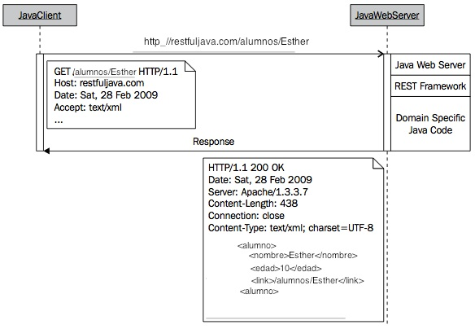

<!-- ************************************************************************-->
# Acceso a servicios REST

Cuando las aplicaciones móviles se conectan a un servidor web, normalmente no buscan obtener un documento web (como en el caso de los navegadores, que normalmente solicitarán documentos HTML), sino que lo que hacen es acceder a servicios. Estos servicios nos pueden servir para realizar alguna operación en el servidor, o para obtener información en un formato que nuestra aplicación sea capaz de entender y de procesar. Un servicio consiste en una interfaz que nos da acceso a ciertas funcionalidades. Al realizarse el acceso a estos servicios mediante protocolos web, como HTTP, hablamos de servicios web.

Existen diferentes tipos de servicios web. Uno de los principales tipos de servicios web son los servicios SOAP. Se trata de un estándar XML que nos permite crear servicios con un alto grado de operabilidad, dado que la forma de consumirlos será idéntica, independientemente de la plataforma en la que estén implementados. Además, al definirse de forma estándar existen herramientas que nos permiten integrarlos casi de forma automática en cualquier lenguaje y plataforma. Sin embargo, tienen el inconveniente de que para conseguir dicha interoperabilidad y facilidad de integración necesitan definir un XML demasiado pesado y rígido, lo cual resulta poco adecuado para dispositivos móviles y para la web en general. Estos servicios se utilizan comúnmente para integración de aplicaciones, y en el ámbito de grandes aplicaciones transaccionales.

Para la web y dispositivos móviles se ha impuesto otro estilo para crear servicios web. Se trata del estilo REST, que acerca los servicios web a la web. Se trata de servicios fuertemente vinculados a los protocolos web (HTTP) sobre los que se invocan, en los que tendremos una gran flexibilidad a la hora de elegir el formato con el que queremos intercambiar la información. Vamos a centrarnos en estudiar este estilo REST.


<!-- ************************************************************************-->
## Fundamentos de REST

El estilo REST (_Representational State Transfer_ o Transferencia de Estado Representacional) es una forma ligera de crear Servicios Web. El elemento principal en el que se basan estos servicios son las URLs. En líneas generales podemos decir que estos servicios consisten en URLs a las que podemos acceder, por ejemplo mediante protocolo HTTP, para obtener información o realizar alguna operación. El formato de la información que se intercambie con estas URLs lo decidirá el desarrollador del servicio. Este tipo de servicios acercan los Servicios Web al tipo de arquitectura de la _web_, siendo especialmente interesantes para su utilización en AJAX o la construcción de una API.

El término REST proviene de la tesis doctoral de Roy Fielding, publicada en el año 2000, y significa *_REpresentational State Transfer_*. REST es un conjunto de restricciones que, cuando son aplicadas al diseño de un sistema, crean un estilo arquitectónico de software. Dicho estilo arquitectónico se caracteriza por:


* Debe ser un sistema cliente-servidor
* Tiene que ser sin estado, es decir, no hay necesidad de que los servicios guarden las sesiones de los usuarios (cada petición al servicio tiene que ser independiente de las demás)
* Debe soportar un sistema de _cachés_: la infraestructura de la red debería soportar _caché_ en diferentes niveles.
* Debe ser un sistema uniformemente accesible (con una interfaz uniforme): cada recurso debe tener una única dirección y un punto válido de acceso. Los recursos se identifican con URIs, lo cual proporciona un espacio de direccionamiento global para el descubrimiento del servicio y de los recursos.
* Tiene que ser un sistema por capas: por lo tanto debe soportar escalabilidad.
* Debe utilizar mensajes auto-descriptivos: los recursos se desacoplan de su representación de forma que puedan ser accedidos en una variedad de formatos, como por ejemplo XML, JSON, HTML, texto plano, PDF, JPEG, etc.


Estas restricciones no dictan qué tipo de tecnología utilizar; solamente definen cómo se transfieren los datos entre componentes y qué beneficios se obtienen siguiendo estas restricciones. Por lo tanto, un sistema RESTful puede implementarse en cualquier arquitectura de la red disponible. Y lo que es más importante, no es necesario "inventar" nuevas tecnologías o protocolos de red: podemos utilizar las infraestructuras de red existentes, tales como la Web, para crear arquitecturas RESTful.


Antes de que las restricciones REST fuesen formalizadas, ya disponíamos de un ejemplo de un sistema RESTful: la Web (estática). Por ejemplo, la infraestructura de red existente proporciona sistemas de _caché_, conexión sin estado, y enlaces únicos a los recursos, en donde los recursos son todos los documentos disponibles en cada sitio web y las representaciones de dichos recursos son conjuntos de ficheros "legibles" por navegadores web (por ejemplo, ficheros HTML). Por lo tanto, la web estática es un sistema construido sobre un estilo arquitectónico REST.


A continuación analizaremos las abstracciones que constituyen un sistema RESTful: recursos, representaciones, URIs, y los tipos de peticiones HTTP que constituyen la interfaz uniforme utilizada en las transferencias cliente/servidor


<!-- ************************************************************************-->
## Recursos

Un recurso REST es cualquier cosa que sea direccionable a través de la Web. Por direccionable nos refererimos a recursos que puedan ser accedidos y transferidos entre clientes y servidores. Por lo tanto, un recurso es una correspondencia lógica y temporal con un concepto en el dominio del problema para el cual estamos implementando una solución.

Algunos ejemplos de recursos REST son:

* Una noticia de un periódico.
* La temperatura de Alicante a las 4:00pm.
* Un valor de IVA almacenado en una base de datos.
* Una lista con el historial de las revisiones de código en un sistema CVS.
* Un estudiante en alguna aula de alguna universidad.
* El resultado de una búsqueda de un ítem particular en Google.

Aun cuando el mapeado de un recurso es único, diferentes peticiones a un recurso pueden devolver la misma representación binaria almacenada en el servidor. Por ejemplo, consideremos un recurso en el contexto de un sistema de publicaciones. En este caso, una petición de la "última revisión publicada" y la petición de "la revisión número 12" en algún momento de tiempo pueden devolver la misma representación del recurso: cuando la última revisión sea efectivamente la 12. Por lo tanto, cuando la última revisión publicada se incremente a la versión 13, una petición a la última revisión devolverá la versión 13, y una petición de la revisión 12, continuará devolviendo la versión 12. En definitiva: cada uno de los recursos puede ser accedido directamente y de forma independiente, pero diferentes peticiones podrían "apuntar" al mismo dato.


Debido a que estamos utilizando HTTP para comunicarnos, podemos transferir cualquier tipo de información que pueda transportarse entre clientes y servidores. Por ejemplo, si realizamos una petición de un fichero de texto de la CNN, nuestro navegador mostrará un fichero de texto. Si solicitamos una película flash a YouTube, nuestro navegador recibirá una película flash. En ambos casos, los datos son transferidos sobre TCP/IP y el navegador conoce cómo interpretar los _streams_ binarios debido a la cabecera de respuesta del protocolo HTTP _Content-Type_. Por lo tanto, en un sistema RESTful, la representación de un recurso depende del tipo deseado por el cliente (tipo MIME), el cual está especificado en la petición del protocolo de comunicaciones.


<!-- ************************************************************************-->
## Representación

La representación de los recursos es lo que se envía entre los servidores y clientes. Una representación muestra el estado del dato real almacenado en algún dispositivo de almacenamiento en el momento de la petición. En términos generales, es un _stream_ binario, juntamente con los metadatos que describen cómo dicho _stream_ debe ser consumido por el cliente y/o servidor (los metadatos también pueden contener información extra sobre el recurso, como por ejemplo información de validación y encriptación, o código extra para ser ejecutado dinámicamente).

Los clientes que solicitan un recurso pueden indicar el tipo de representación del mismo. Por lo tanto, una representación puede tener varias formas, como por ejemplo, una imagen, un texto, un fichero XML o un fichero JSON, pero tienen que estar disponibles en la misma URL.

Para respuestas generadas para humanos a través de un navegador, una representación típica tiene la forma de página HTML. Para respuestas automáticas de otros servicios web, la legibilidad no es importante y puede utilizarse una representación mucho más eficiente como por ejemplo XML o JSON.

El lenguaje para el intercambio de información con el servicio queda a elección del desarrollador. A continuación mostramos algunos formatos comunes que podemos utilizar para intercambiar esta información:

<table>
<tr>
<th>Formato</th>
<th>Tipo MIME</th>
</tr>
<tr>
<td>Texto plano</td>
<td>`text/plain`</td>
</tr>
<tr>
<td>HTML</td>
<td>`text/html`</td>
</tr>
<tr>
<td>XML</td>
<td>`application/xml`</td>
</tr>
<tr>
<td>JSON</td>
<td>`application/json`</td>
</tr>
</table>

De especial interés es el formato JSON. Se trata de un lenguaje ligero de intercambio
de información, que puede utilizarse en lugar de XML (que resulta considerablemente
más pesado) para aplicaciones AJAX. De hecho, en Javascript puede leerse este tipo de
formato simplemente utilizando el método `eval()`.


<!-- ************************************************************************-->
## URI

Una URI, o *Uniform Resource Identifier*, en un servicio web RESTful es un hiper-enlace a un recurso, y es la única forma de intercambiar representaciones entre clientes y servidores. Un servicio web RESTful expone un conjunto de recursos que identifican los objetivos de la interacción con sus clientes.


El conjunto de restricciones REST no impone que las URIs deban ser hiper-enlaces. Simplemente hablamos de hiper-enlaces porque estamos utilizando la Web para crear servicios web. Si estuviésemos utilizando un conjunto diferente de tecnologías soportadas, una URI RESTful podría ser algo completamente diferente. Sin embargo, la idea de direccionabilidad debe permanecer.


En un sistema REST la URI no cambia a lo largo del tiempo, ya que la implementación de la arquitectura es la que gestiona los servicios, localiza los recursos, negocia las representaciones, y envía respuestas con los recursos solicitados. Y lo que es más importante, si hubiese un cambio en la estructura del dispositivo de almacenamiento en el lado del servidor (por ejemplo, un cambio de servidores de bases de datos), nuestras URIs seguirán siendo las mismas y serán válidas mientras el servicio web siga estando "en marcha" o el contexto del recurso no cambie.


Sin las restricciones REST, los recursos se acceden por su localización: las direcciones web típicas son URIs fijas. Si por ejemplo renombramos un fichero en el servidor, la URI será diferente; si movemos el fichero a otro directorio, la URI también será diferente.


Por ejemplo, si en nuestra aplicación tenemos información de cursos, podríamos acceder a la lista de cursos disponibles mediante una URL como la siguiente:

<a href="http://jtech.ua.es/resources/cursos">http://jtech.ua.es/resources/cursos</a>

Esto nos devolverá la lista de cursos en el formato que el desarrollador del servicio haya decidido. Hay que destacar por lo tanto que en este caso debe haber un entendimiento entre el consumidor y el productor del servicio, de forma que el primero comprenda el lenguaje utilizado por el segundo.

Esta URL nos podría devolver un documento como el siguiente:

```xml
<?xml version="1.0"?>
<j:Cursos xmlns:j="http://www.jtech.ua.es"
         xmlns:xlink="http://www.w3.org/1999/xlink">
  <Curso id="1"
         xlink:href="http://jtech.ua.es/resources/cursos/1"/>
  <Curso id="2"
         xlink:href="http://jtech.ua.es/resources/cursos/2"/>
  <Curso id="4"
         xlink:href="http://jtech.ua.es/resources/cursos/4"/>
  <Curso id="6"
         xlink:href="http://jtech.ua.es/resources/cursos/6"/>
</j:Cursos>
```

En este documento se muestra la lista de cursos registrados en la aplicación, cada uno de ellos representado también por una URL. Accediendo a estas URLs podremos obtener información sobre cada curso concreto o bien modificarlo.


<!-- ************************************************************************-->
## Uniformidad de las interfaces a través de peticiones HTTP

Ya hemos introducido los conceptos de recursos y sus representaciones. Hemos dicho que los recursos son _mappings_ de los estados reales de las entidades que son intercambiados entre los clientes y servidores. También hemos dicho que las representaciones son negociadas entre los clientes y servidores a través del protocolo de comunicación en tiempo de ejecución (a través de HTTP). A continuación veremos con detalle lo que significa el intercambio de estas representaciones, y lo que implica para los clientes y servidores el realizar acciones sobre dichos recursos.


El desarrollo de servicios web REST es similar al desarrollo de aplicaciones web. Sin embargo, la diferencia fundamental entre el desarrollo de aplicaciones web tradicionales y las más modernas es cómo pensamos sobre las acciones a realizar sobre nuestras abstracciones de datos. De forma más concreta, el desarrollo moderno está centrado en el concepto de *nombres* (intercambio de recursos); el desarrollo tradicional está centrado en el concepto de verbos (acciones remotas a realizar sobre los datos). Con la primera forma, estamos implementando un servicio web RESTful; con la segunda un servicio similar a una llamada a procedimiento remoto- RPC). Y lo que es más, un servicio RESTful modifica el estado de los datos a través de la representación de los recursos (por el contrario, una llamada a un servicio RPC, oculta la representación de los datos y en su lugar envía comandos para modificar el estado de los datos en el lado del servidor). Finalmente, en el desarrollo moderno de aplicaciones web limitamos la ambigüedad en el diseño y la implementación debido a que tenemos cuatro acciones específicas que podemos realizar sobre los recursos: _Create, Retrieve, Update, Delete (CRUD)_. Por otro lado, en el desarrollo tradicional de aplicaciones web, podemos tener otras acciones con nombres o implementaciones no estándar.


A continuación mostramos la correspondencia entre las acciones CRUD sobre los datos y los métodos HTTP correspondientes:

| Acción sobre los datos | Protocolo HTTP equivalente |
| ---------------------- | -------------------------- |
| CREATE                 | POST                       |
| RETRIEVE               | GET                        |
| UPDATE                 | PUT                        |
| DELETE                 | DELETE                     |


En su forma más simple, los servicios web RESTful son aplicaciones cliente-servidor a través de la red que manipulan el estado de los recursos. En este contexto, la manipulación de los recursos significa creación de recursos, recuperación, modificación y borrado. Sin embargo, los servicios web RESTful no están limitados solamente a estos cuatro conceptos básicos de manipulación de datos. Por el contrario, los servicios RESTful pueden ejecutar lógica en el lado del servidor, pero recordando que cada respuesta debe ser una representación del recurso del dominio en cuestión. Deberemos determinar qué operación HTTP se ajusta mejor a la manipulación que deseamos realizar sobre los datos. Mención especial merece el método PUT, ya que no se trata simplemente de una actualización de los datos, sino de establecer el estado del recurso, exista previamente o no. A continuación trataremos cada uno de estos métodos con más detalle.


> Nota: Una interfaz uniforme centra la atención en los conceptos abstractos que hemos visto: recursos, representaciones y URIs. Por lo tanto, si consideramos todos estos conceptos en su conjunto, podemos describir el desarrollo RESTful en una frase: utilizamos URIs para conectar clientes y servidores para intercambiar recursos en forma de sus representaciones. O también: en una arquitectura con estilo REST, los clientes y servidores intercambian representaciones de los recursos utilizando un protocolo e interfaces estandarizados.


<!-- ************************************************************************-->
# Tipos de peticiones HTTP

A continuación vamos a ver los cuatro tipos de peticiones HTTP con detalle, y veremos cómo se utiliza cada una de ellas para intercambiar representaciones para modificar el estado de los recursos.


<!-- ************************************************************************-->
## GET/RETRIEVE

El método GET se utiliza para *RECUPERAR* recursos. Antes de indicar la mecánica de la peticion GET, vamos a determinar cuál es el recurso que vamos a manejar y el tipo de representación que vamos a utilizar. Para ello vamos a seguir un ejemplo de un servicio web que gestiona alumnos en una clase, con la URI: _http://restfuljava.com_. Para dicho servicio, asumiremos una representación como la siguiente:


```xml
<alumno>
    <nombre>Esther</nombre>
    <edad>10</edad>
    <link>/alumnos/Jane</link>
</alumno>
```


Una lista de alumnos tendrá el siguiente aspecto:

```xml
<alumnos>
  <alumno>
    <nombre>Esther</nombre>
    <edad>10</edad>
    <link>/alumnos/Esther</link>
  <alumno>
  <alumno>
    <nombre>Pedro</nombre>
    <edad>11</edad>
    <link>/alumnos/Pedro</link>
  <alumno>
</alumnos>
```


Una vez definida nuestra representación, asumimos que las URIs tienen la forma: _http://restfuljava.com/alumnos_ para acceder a la lista de alumnos, y _http://restfuljava.com/alumnos/{nombre}_ para acceder a un alumno específico con el identificador con el valor _nombre_.


Ahora hagamos peticiones sobre nuestro servicio. Por ejemplo, si queremos recuperar la información de una alumna con el nombre _Esther_, realizamos una petición a la URI: _http://restfuljava.com/alumnos/Esther_.

Una representación de _Esther_ en el momento de la petición, puede ser ésta:

```xml
<alumno>
   <nombre>Esther</nombre>
   <edad>10</edad>
   <link>/alumnos/Esther</link>
</alumno>
```

También podríamos acceder a una lista de estudiantes a través de la URI: y _http://restfuljava.com/alumnos_ y la respuesta del servicio sería algo similar a ésta (asumiendo que solamente hay dos alumnos):


```xml
<alumnos>
  <alumno>
    <nombre>Esther</nombre>
    <edad>10</edad>
    <link>/alumnos/Esther</link>
  <alumno>
  <alumno>
    <nombre>Pedro</nombre>
    <edad>11</edad>
    <link>/alumnos/Pedro</link>
  <alumno>
</alumnos>
```

Echemos un vistazo a los detalles de la petición. Una petición para recuperar un recurso _Esther_ usa el método GET con la URI: _http://restfuljava.com/alumnos/Esther_. Un diagrama de secuencia de dicha petición sería como el que mostramos a continuación:




<!--

-->

¿Qué está ocurriendo aquí?:

* Un cliente realiza una petición HTTP con el método GET y Esther es el identificador del alumno.
* El cliente establece la representación solicitada a través del campo de cabecera `Accept`.
* El servidor web recibe e interpreta la petición GET como una acción RETRIEVE. En este momento, el servidor web cede el control al _framework_ RESTful para gestionar la petición. Remarquemos que los _frameworks_ RESTful no recuperan de forma automática los recursos, ése no es su trabajo. La función del _framework_ es facilitar la implementación de las restricciones REST. La lógica de negocio y la implementación del almacenamiento es el papel del código específico del dominio.
* El programa del lado del servidor busca el recurso _Esther_. Encontrar el recurso podría significar buscarlo en una base de datos, un sistema de ficheros, o una llamada a otro servicio web.
* Una vez que el programa encuentra a _Esther_, convierte el dato binario del recurso a la representación solicitada por el cliente.
* Con la representación convertida a XML, el servidor envía de vuelta una respuesta HTTP con un código numérico de 200 (`Ok`) junto con la representación solicitada. Si hay algún error, el servidor HTTP devuelve el código numérico correspondiente, pero es el cliente el que debe tratar de forma adecuada el fallo. El fallo más común es que el recurso no exista, en cuyo caso se devolvería el código 404 (`Not Found`).


Todos los mensajes entre el cliente y el servidor son llamadas del protocolo estándar HTTP. Para cada acción de recuperación, enviamos una petición GET y obtenemos una respuesta HTTP con la representación del recurso solicitada, o bien, si hay un fallo, el correspondiente código de error (por ejemplo, `404 Not Found` si un recurso no se encuentra; `500 Internal Server Error` si hay un problema con el código que procesa la petición en servidor).

En las peticiones de recuperación de datos resulta recomendable también implementar un sistema de caché. Para hacer esto utilizaremos el código de respuesta `304 Not Modified` en caso de que los datos no hubiesen cambiado desde la última petición que realizamos (se podría pasar un parámetro con la fecha en la que obtuvimos la representación por última vez). De esta forma, si un cliente recibe ese código como respuesta, sabe que puede seguir trabajando con la representación de la que ya dispone, sin tener que descargar una nueva.

Solicitar una representación para todos los alumnos funciona de forma similar.

> Nota: El método HTTP GET solamente debería utilizarse para recuperar representaciones. Podríamos utilizar una petición GET para actualizar el estado de los datos en el servidor, pero no es recomendable. Una operación GET  debe ser segura e idempotente (para más información ver <a href="http://www.w3.org/DesingIssues/Axioms">http://www.w3.org/DesingIssues/Axioms</a>. Para que una petición sea *segura*, múltiples peticiones al mismo recurso no deben cambiar el estado de los datos en el servidor. Por ejemplo, supongamos una petición en el instante t1 para un recurso R devuelve R1; a continuación, una petición en el instante t2 para R devuelve R2; suponiendo que no hay más acciones de modificación entre t1 y t2, entonces R1 = R2 = R. Para que una petición sea *idempotente* tiene que ocurrir que múltiples llamadas a la misma acción dejan siempre el mismo estado en el recurso. Por ejemplo, múltiples llamadas para crear un recurso R en los instantes t1, t2, y t3, darían como resultado que el recurso R existe sólo como R, y que las llamadas en los instantes t2 y t3 son ignoradas.


<!-- ************************************************************************-->
## POST/CREATE

El método POST se utiliza para *CREAR* recursos. Vamos a utilizar el método HTTP POST para crear un nuevo alumno. De nuevo, la URI para añadir un nuevo alumno a nuestra lista será: _http://restfuljava.com/alumnos_. El tipo de método para la petición lo determina el cliente.


Asumamos que el alumno con nombre _Ricardo_ no existe en nuestra lista y queremos añadirlo. Nuestra nueva representación XML de _Ricardo_ es:


```xml
<alumno>
   <nombre>Ricardo</nombre>
   <edad>10</edad>
   <link></link>
</alumno>
```

El elemento _link_ forma parte de la representación, pero está vacío debido a que éste valor se genera en tiempo de ejecución y no es creado por el cliente cuando envía la petición POST. Esto es solamente una convención para nuestro ejemplo; sin embargo, los clientes que utilizan el servicio web pueden especificar la estructura de las URIs.

En este caso, no mostraremos el escenario, pero los pasos que se siguen cuando se realiza la petición son los siguientes:

* Un cliente realiza una petición HTTP a la URI _http://restfuljava.com/alumnos_, con el método HTTP POST.
* La petición POST incluye una representación en forma de XML de _Ricardo_.
* El servidor web recibe la petición y delega en el _framework_ REST para que la gestione; nuestro código dentro del _framework_ ejecuta los comandos adecuados para almacenar dicha representación (de nuevo, el dispositivo de almenamiento puede ser cualquiera).
* Una vez que se ha completado el almacenamiento del nuevo recurso, se envía una respuesta de vuelta: si no ha habido ningún error, enviaremos el código 201 (`Created`); si se produce un fallo, enviaremos el código de error adecuado. Además, podemos devolver en la cabecera `Location` la URL que nos dará acceso al recurso recién creado.

```plain
Location: http://restfuljava.com/alumnos/Ricardo
```

Las peticiones POST no son idempotentes, por lo que si invocamos una misma llamada varias veces sobre un mismo recurso, el estado del recurso puede verse alterado en cada una de ellas. Por ejemplo, si ejecutamos varias veces la acción POST con los datos del ejemplo anterior, podríamos estar creando cada vez un nuevo alumno de nombre `Ricardo`, teniendo así varios alumnos con el mismo nombre y edad (pero asociados a IDs distintos, por ejemplo: `/Ricardo`, `/Ricardo1`, `/Ricardo2`, etc).


<!-- ************************************************************************-->
## PUT/UPDATE

El método PUT se utiliza para *ACTUALIZAR* (modificar) recursos, o para crearlos si el recurso en la URI especificada no existiese previamente. Es decir, PUT se utiliza para establecer un determinado recurso, dada su URI, a la representación que proporcionemos, independientemente de que existiese o no. Para actualizar un recurso, primero necesitamos su representación en el cliente; en segundo lugar, en el lado del cliente actualizaremos el recurso con los nuevos valores deseados; y finalmente, actualizaremos el recurso mediente una petición PUT, adjuntando la representación correspondiente.


Para nuestro ejemplo, omitiremos la petición GET para recuperar a _Esther_ del servicio web, ya que es el mismo que acabamos de indicar en la sección anterior. Supongamos que queremos modificar la edad, y cambiarla de 10 a 12. La nueva representación será:

```xml
<alumno>
   <nombre>Esther</nombre>
   <edad>12</edad>
   <link>/alumnos/Esther</link>
</alumno>
```

La secuencia de pasos necesarios para enviar/procesar la petición PUT es:

* Un cliente realiza una petición HTTP PUT a la URI _http://restfuljava.com/alumnos/Esther_, incluyendo la nueva definición XML.
* El servidor web recibe la petición y delega en el _framework_ REST para que la gestione; nuestro código dentro del _framework_ ejecuta los comandos adecuados para actualizar la representación de _Esther_.
* Una vez que se ha completado la actualización, se envía una respuesta al cliente. Si el recurso que hemos enviado no existía previamente, se devolverá el código 201 (`Created`). En caso de que ya existiese, se podría devolver 200 (`Ok`) con el recurso actualizado como contenido, o simplemente 204 (`No Content`) para indicar que la operación se ha realizado correctamente sin devolver ningún contenido.

Muchas veces se confunden los métodos PUT y POST. El significado de estos métodos es el siguiente:


* *POST*: Publica datos en un determinado recurso. El recurso debe existir previamente y los datos enviados son añadidos a él. Por ejemplo, para añadir nuevos alumnos con POST hemos visto que debíamos hacerlo con el recurso lista de alumnos (`/alumnos`), ya que la URI del nuevo alumno todavía no existe. La operación *no es idempotente*, es decir, si añadimos varias veces el mismo alumno aparecerá repetido en nuestra lista de alumnos con URIs distintas.
* *PUT*: Hace que el recurso indicado tome como contenido los datos enviados. El recurso podría no existir previamente, y en caso de que existiese sería sobrescrito con la nueva información. A diferencia de POST, PUT *es idempotente*. Múltiples llamadas idénticas a la misma acción PUT siempre dejarán el recurso en el mismo estado. La acción se realiza sobre la URI concreta que queremos establecer (por ejemplo, `/alumnos/Esther`), de forma que varias llamadas consecutivas con los mismos datos tendrán el mismo efecto que realizar sólo una de ellas.

Podríamos añadir nuevos alumnos de dos formas diferentes. La primera de ellas es haciendo POST sobre el recurso que contiene la lista de alumnos:

```plain
POST /alumnos 
```

También podríamos hacer PUT sobre el recurso de un alumno concreto:

```plain
PUT /alumnos/Esther 
```

Si _Esther_ existía ya, sobrescribirá sus datos, en casa contrario, creará el nuevo recurso.

Si utilizamos POST de esta última forma, sobre un recurso concreto, si el recurso existiese podríamos realizar alguna operación que modifique sus datos, pero si no existiese nos daría un error, ya que no podemos hacer POST sobre un recurso inexistente.

```plain
POST /alumnos/Esther
```

El caso anterior sólo será correcto si _Esther_ existe, en caso contrario obtendremos un error. Para crear nuevos recursos con POST debemos recurrir al recurso del conjunto de alumnos. Una diferencia entre estas dos formas alternativas de crear nuevos recursos es que con PUT podemos indicar explícitamente el identificador del recurso creado, mientras que con POST será el servidor quien lo decida.


<!-- ************************************************************************-->
## DELETE/DELETE

El método DELETE se utiliza para *BORRAR* representaciones. Para nuestro ejemplo, usaremos la misma URI de las secciones anteriores.

La secuencia de pasos necesarios para enviar/procesar la petición DELETE es:

* Un cliente realiza una petición DELETE a la URI _http://restfuljava.com/alumnos/Esther_
* El servidor web recibe la petición y delega en el _framework_ REST para que la gestione; nuestro código dentro del _framework_ ejecuta los comandos adecuados para borrar la representación de _Esther_.
* Una vez que se ha completado la actualización, se envía una respuesta al cliente. Se podría devolver 200 (`Ok`) con el recurso borrado como contenido, o simplemente 204 (`No Content`) para indicar que la operación se ha realizado correctamente sin devolver ningún contenido.

Hasta aquí hemos visto las principales acciones que podemos realizar con los recursos en un servicio web RESTful. No conocemos cómo el servicio web implementa el almacenamiento de los datos, y no conocemos qué tecnologías se utilizan para implementar el servicio. Todo lo que conocemos es que nuestro cliente y servidor se comunican a través de HTTP, que usamos dicho protocolo de comunicaciones para enviar peticiones, y que nuestras representaciones de los recursos se intercambian entre el cliente y el servidor a través del intercambio de URIs.


<!-- ************************************************************************-->
# Aclaraciones

* Cuando utilizamos el término REST nos referimos a la arquitectura y por RESTful a un servicio que implementa dicha arquitectura. 

* En los ejemplos se ha utilizado como representación de un recurso la notación XML sin embargo se puede utilizar cualquier tipo de notación, siendo JSON la más utilizada actualmente para los servicios web. 

* No es necesario implementar siempre todos los tipos de peticiones. Esto dependerá de las acciones que queramos permitir que se realicen con un determinado recurso. 

* Como respuesta a una petición a uno de estos servicios se tiene que devolver un código en la cabecera indicando si la petición se ha realizado correctamente o no. Mediante este código se puede indicar el tipo de error o información adicional sobre la acción realizada. 

* Los código indicados para indicar que una operación se ha realizado correctamente o que ha habido un error y el tipo de error dependerán del servicio en cuestión. 

* Tras crear una petición con una petición tipo POST se suele añadir a la cabecera la URI del nuevo recurso creado, por ejemplo: `Location: http://restfuljava.com/alumnos/Ricardo`.

* Como respuesta a las peticiones tipo POST, PUT y DELETE, además de devolver el códico de respuesta se puede incluir informacin adicional. Esto dependerá de la API en custión, y puede ser interesante para por ejemplo añadir el mensaje de error traducidoo o alguna otra información necesaria. 


