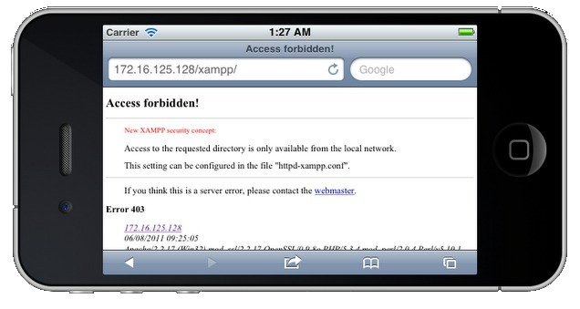

# Desarrollo Web para móviles


<!-- ********************************************************************* -->
## Introducción

La Web móvil es la misma Web que la de escritorio, utiliza la misma arquitectura básica y muchas de las mismas tecnologías. Pero existen claras diferencias que impiden que su funcionamiento y manejo sea el mismo, como son: el tamaño de la pantalla, las diferentes formas de uso (táctil, teclado del móvil, etc.) y el ancho de banda.

Otra diferencia que se debería de tener en cuenta es que es "móvil". Accedemos a Internet desde lugares en los que sería imposible hacerlo con un ordenador de sobremesa o incluso un portátil. Esto influye también en el uso que le damos, se hacen más búsquedas o consultas, además de que la información se debe de disponer de forma más clara y directa.

Debido a todo esto, al programar una Web para móvil debemos de tener en cuenta que ni el contenido, ni la apariencia, ni la estructura de la web va a ser la misma que la que podríamos hacer para un ordenador de escritorio. Hemos de diseñar muy bien este tipo de aplicaciones y orientarlas al uso principal que le va a dar el usuario. Para esto se suele referir a la _regla del 20%_: el 80% del contenido del sitio web de escritorio no es válido para una web móvil. Por lo que hemos de centrarnos en ese 20% restante, averiguar cual es, y optimizar nuestro sitio para este uso.


<!-- ********************************************************************* -->
### Aplicación móvil vs. Aplicación nativa

Los desarrolladores de aplicaciones nativas tienen la ventaja de poder usar funciones no disponibles para la web móvil:

* El uso de interfaces nativas que proveen los propios SDK como iPhone o Android.

* El uso de bases de datos locales. Aunque en HTML 5 se pueden usar el almacenamiento local, hay que reconocer que estas tecnologías están más avanzadas en los sistemas nativos.

* Notificaciones push. A esto se refiere con los avisos centralizados que muestran las aplicaciones, aún cuando están ocultas. Una fuerte razón que no puede ser implementada en una web móvil.

* Geolocalización. Hemos visto algunos ejemplos de geolocalización a través de HTML5, pero que no acaban de alcanzar la misma experiencia de usuario que una aplicación móvil. Podemos interactuar con el mapa o con las funcionalidades asociadas a la localización del usuario, pero no ir mucho más allá.

* Soporte para cámara o vídeo. Las funciones multimedia están perfectamente acopladas a las aplicaciones nativas, pudiendo añadir funcionalidades especificas a nuestra aplicación.


Sin embargo estas diferencias cada vez se van haciendo menores:

* Gracias al uso de HTML5, CSS3 y JavaScript cada vez se pueden hacer más cosas y obtener mejores resultados.

* Cada vez hay mejores frameworks de desarrollo para aplicaciones móviles, como JQuery Mobile, Sencha Touch o Ionic. Estos nos permiten crear webs con apariencia cercana a las de las aplicaciones nativas, pero a su vez con toda la potencia de la Web. Estos framework nos permiten adaptar el contenido según el dispositivo usado y sus posibilidades técnicas: pantalla táctil, reproducción de vídeos o resolución de pantalla. Por lo que podríamos decir que una Web móvil es mucho más adaptable (además de multiplataforma) que una aplicación móvil.

* La web sigue siendo el negocio principal de muchas empresas de Internet. El desarrollo web no ha muerto por la inclusión de las aplicaciones móviles, sino que se ve afectado por un proceso de cambio hacía la adopción de tecnologías nuevas como HTML5.

* La inclusión de la tecnología _PhoneGap_ también está recortando más estas diferencias. _PhoneGap_ es la posibilidad de crear una aplicación nativa instalable a partir de una página Web móvil, permitiendo además su distribución en _Android Market_ o en la _App Store_. Además estas tecnologías facilitan el uso de funcionalidades del dispositivo móvil directamente a través de código JavaScript, como puede ser el acceso a la cámara, acelerómetro, geolocalización, listado de contactos, comprobar el estado de la conexión, etc.


<!-- *********************************************************************** -->
### Reglas de usabilidad

A la hora de iniciar el desarrollo de una Web para móvil es importante tener en cuenta una serie de reglas básicas:


**1. Reducir la cantidad de contenido**

Las aplicaciones móviles deben de ser optimizadas dado que el espacio visual es mucho más limitado que en una pantalla de ordenador. Cada píxel cuenta, y no todo lo que es válido para una Web de escritorio lo es para una Web móvil.

Solo debemos de incluir el contenido y las características principales y más importantes. Los contenidos con menor importancia deben de ser eliminados, como contenidos secundarios, normalmente localizados en columnas laterales o en la parte inferior.

La web móvil debe de estar enfocada a este contenido principal. Facilitar su lectura y navegación, así como mejorar los tiempos de carga reduciendo imágenes y contenidos.


**2. Usar una sola columna**

Las páginas Web anchas y con varias columnas dificultan la navegación y lectura en un dispositivo móvil. Incluso en los terminales móviles con pantallas más grandes hay que realizar zoom para moverse y ver bien el contenido. Esta es una práctica que debemos evitar, pues tener que ir realizando zoom añade más pasos a la navegación, y en algunos dispositivos no es tan fácil de realizar como en un iPhone.

Lo mejor es tener nuestro contenido en una sola columna que use todo el ancho de la pantalla. Para añadir contenido lo deberemos de hacer hacia abajo (o creando una página nueva), nunca hacia los lados (o creando columnas). Esto nos asegura que el contenido se va a visualizar correctamente, además es mucho más intuitivo realizar _scroll_ hacia abajo para ir leyendo.


**3. Muestra los enlaces de navegación de forma diferente**

No pongas todos los enlaces de navegación en la parte superior de la pantalla. Si hay muchos desplazarán todo el contenido hacia abajo, y es posible que los tengas que poner muy reducidos.

La página principal debería de contener los enlaces al resto del contenido junto con un buscador (si fuese necesario). El contenido debería de estar en páginas secundarias bien organizado. Por ejemplo, cuando un usuario entra en un sitio de _eCommerce_ suelen tener una categoría de producto en mente que quiere consultar, la cual la podrían encontrar usando el buscador o directamente a partir del menú. Es decir, la página principal debe facilitar el acceso rápido a la información más importante de la web.

También hay otras opciones para colocar el menú de navegación, como una lista desplegable o al final de la página. Son muy cómodas las barras de herramientas estáticas que ofrecen las opciones principales (volver a la página inicial, botones principales, etc.).


**4. Minimiza la cantidad de datos solicitados**

Escribir texto utilizando un terminal móvil es mucho más difícil que hacerlo utilizando el teclado de un ordenador de sobremesa. Además los usuarios suelen escribir mucho más lento y cometer más errores. Por estas razones tenemos que intentar minimizar la cantidad de texto solicitado.

Una forma de conseguir esto es permitir almacenar los datos (usuario, contraseñas, configuración, direcciones, etc.), o aprovechar algunas de las funcionalidades que incorporan los dispositivos móviles (como veremos más adelante).


**5. Decide si necesitas más de una Web para móvil**

El tamaño de pantalla, la capacidad de procesamiento y de usabilidad varía enormemente de un terminal a otro. Por esta razón a veces debemos de considerar crear varios sitios web con el mismo contenido pero adaptado a diferentes necesidades. Por ejemplo, Facebook tiene <a href="m.facebook.com">m.facebook.com</a> como sitio web principal para móviles, pero además tiene una versión optimizada para pantallas táctiles (<a href="touch.facebook.com">touch.facebook.com</a>) y una versión optimizada para conexiones más lentas (<a href="0.facebook.com">0.facebook.com</a>).


**6. Diseña para pantallas táctiles, pero también para teléfonos no-táctiles**

La forma de navegar por las páginas web es muy diferente según el dispositivo: pantallas táctiles, _trackball_, _joystick_, teclado, etc. Estas características también son importantes a la hora de realizar el diseño. Por ejemplo, la principal dificultad está en la selección y pulsado sobre textos o enlaces pequeños. En las pantallas táctiles además se dificulta pulsar sobre elementos que estén muy juntos.

Por esta razón, los enlaces o elementos que puedan ser seleccionados deben de ocupar un mayor espacio en pantalla, incluirlos en botones o cuadros más grandes, que puedan ser pulsados con facilidad.


**7. Aprovecha las funcionalidades que incorporan los móviles**

Los teléfonos móviles tienen algunas ventajas sobre los PCs, las cuales pueden facilitar la realización de algunas tareas. Algunas de estas funcionalidades añadidas son:

Realizar llamadas: puede parecer evidente pero es una funcionalidad muy útil que los PCs no pueden realizar tan fácilmente. Por esta razón debemos de aprovecharla para, por ejemplo, llamar directamente al presionar sobre un número de teléfono, facilitar el contacto con un servicio técnico, etc.

Uso de mapas y posición actual: es posible dar la opción al usuario de seleccionar una dirección y que automáticamente se abra en la aplicación de mapas del dispositivo móvil. También es muy interesante el uso de la posición actual para mostrar puntos de interés cercanos, calcular rutas, etc.

Solicitud de información de forma innovadora: como por ejemplo los códigos QR, que se han usado en algunas campañas de publicidad, etc.

Al cumplir esta serie de reglas se incrementa el público que puede acceder a los contenidos, creando sitios Web eficaces y haciendo la navegación accesible desde más dispositivos.


<!-- *********************************************************************** -->
### Dominio

Existen diferentes alternativas sobre el dominio que podemos usar. En definitiva esta es una decisión personal, pues todas ellas tienen sus ventajas e inconvenientes. La única recomendación que se suele hacer es tener varias opciones disponibles, con la intención de facilitar al máximo el acceso.

Podemos tener un subdominio de nuestro sitio Web especializado para dispositivos móviles. Por ejemplo, si nuestro sitio Web es _www.midominio.com_, el sitio para dispositivos móviles podría ser _m.midominio.com_. Por ejemplo, Facebook tiene disponibles los sitios <a href="m.facebook.com">m.facebook.com</a>
(como sitio web para dispositivos móviles) y <a href="touch.facebook.com">touch.facebook.com</a> (para dispositivos táctiles).

También podemos usar el dominio principal y diferenciar (desde el cliente o desde el servidor) si se trata de un dispositivo móvil. En este caso el usuario accedería a la misma dirección pero sería redirigido al sitio correspondiente o se le devolvería un contenido diferente.

Otra opción es comprar un dominio "_.mobi_" (especial para web móvil) con el mismo nombre que la web principal.

Si optamos por dar diferentes opciones de acceso deberemos crear redirecciones
301 al dominio principal seleccionado para manejar ese contenido, de la forma:

```php
<?php
header("HTTP/1.1 301 Moved Permanently");
header("location:http://www.nueva_url.com");
?>
```


<!-- *********************************************************************** -->
### Detección del navegador

Un dilema a la hora de desarrollar contenidos para móviles es cómo diferenciar entre dispositivos móviles y navegadores de escritorio. Esto se puede hacer fácilmente mediante una función de comprobación que nos indique el tipo de navegador que ha solicitado la web. Una vez obtenido el navegador tenemos varias opciones, como se comentaba en la sección anterior: redireccionar al dominio correspondiente, o adaptar el código de nuestra página según el cliente.

A continuación se incluye una función en PHP que nos devuelve un número positio si detecta que el navegador es un dispositivo móvil, y 0 en caso de ser un navegador de escritorio.

```php
public static function mobileBrowser()
{
	$mobile_browser = '0';

	//$_SERVER['HTTP_USER_AGENT'] -> el agente de usuario que está
	// accediendo a la página.
	if(preg_match('/(up.browser|up.link|mmp|symbian|smartphone|midp|wap|phone)/i',
			strtolower($_SERVER['HTTP_USER_AGENT'])))
	{
	    $mobile_browser++;
	}

	//$_SERVER['HTTP_ACCEPT'] -> Indica los tipos MIME que el cliente puede recibir.
	if((strpos(strtolower($_SERVER['HTTP_ACCEPT']),'application/vnd.wap.xhtml+xml')>0)
		or
		((isset($_SERVER['HTTP_X_WAP_PROFILE']) or isset($_SERVER['HTTP_PROFILE']))))
	{
	    $mobile_browser++;
	}

	$mobile_ua = strtolower(substr($_SERVER['HTTP_USER_AGENT'],0,4));
	$mobile_agents = array(
	    'w3c ','acs-','alav','alca','amoi','audi','avan','benq','bird','blac',
	    'blaz','brew','cell','cldc','cmd-','dang','doco','eric','hipt','inno',
	    'ipaq','java','jigs','kddi','keji','leno','lg-c','lg-d','lg-g','lge-',
	    'maui','maxo','midp','mits','mmef','mobi','mot-','moto','mwbp','nec-',
	    'newt','noki','oper','palm','pana','pant','phil','play','port','prox',
	    'qwap','sage','sams','sany','sch-','sec-','send','seri','sgh-','shar',
	    'sie-','siem','smal','smar','sony','sph-','symb','t-mo','teli','tim-',
	    'tosh','tsm-','upg1','upsi','vk-v','voda','wap-','wapa','wapi','wapp',
	    'wapr','webc','winw','winw','xda','xda-');

	//buscar agentes en el array de agentes
	if(in_array($mobile_ua, $mobile_agents)) {
	    $mobile_browser++;
	}

	//$_SERVER['ALL_HTTP'] -> Todas las cabeceras HTTP
	if(strpos(strtolower($_SERVER['ALL_HTTP']),'OperaMini')>0) {
	    $mobile_browser++;
	}
	if(strpos(strtolower($_SERVER['HTTP_USER_AGENT']),'windows')>0) {
	    $mobile_browser=0;
	}

	return $mobile_browser;
}

```


También existen librerías un poco más completas para detectar el cliente usando código PHP como por ejemplo: http://mobiledetect.net/ Esta librería nos permite determinar si el cliente es un ordenador de escritorio, un tablet o un móvil, el sistema operativo que utiliza (Android, iOS, Linux, Windows, etc.), el navegador, versiones, etc.


<!-- *********************************************************************** -->
### Ejemplos de Webs para móviles

Cuando se empieza en el desarrollo de webs para dispositivos móviles es bueno buscar inspiración, ir a ver que ha hecho gente con más experiencia en el campo. A continuación se incluye una pequeña lista de ejemplos:

| http://m.diesel.com <br/>  | http://m.flickr.com/ <br/>  |
| -- | -- |
| http://mobile.walmart.com/ <br/>  | http://m.marksandspencer.com/ <br/>  |
| http://iphonetoolbox.com/dailywallpaper <br/>  | |


En todos de ellos debemos de considerar la adaptación que se ha hecho del contenido entre la web de escritorio y la web para dispositivos móviles. En la siguiente imagen se puede ver una comparación en la que varía la disposición. Pero como hemos dicho, los cambios no son únicamente de disposición, tenemos que recordar la regla del 20%.


<!-- *********************************************************************** -->
<!-- *********************************************************************** -->
<!-- *************************** SERVIDOR WEB ****************************** -->
<!-- *********************************************************************** -->
<!-- *********************************************************************** -->


<!-- *********************************************************************** -->
## Instalación de un servidor Web

En la programación Web, una de las herramientas principales que necesitamos es un servidor Web o servidor HTTP. Este es el encargado de compilar el código (según el lenguaje de programación que utilicemos) y enviarlo al cliente utilizando el protocolo de transferencia HTTP.

Dado que instalar un servidor Web completo y configurarlo correctamente es una tarea bastante costosa, para el desarrollo y testeo de aplicaciones en local se suele utilizar un servidor XAMPP. Este es un paquete software de fácil instalación que incluye todo lo necesario para la ejecución de un servidor Web.

Es independiente de plataforma, software libre (licencia GNU), y consiste principalmente en la base de datos MySQL, el servidor web Apache y los intérpretes para lenguajes de script: PHP y Perl. El nombre proviene del acrónimo formado por **X** (para cualquiera de los diferentes sistemas operativos), **A**pache, **M**ySQL, **P**HP y **P**erl. Actualmente XAMPP está disponible para Microsoft Windows (WAMPP), GNU/Linux (LAMPP), Solaris y MacOS X (MAMPP).


<!-- *********************************************************************** -->
### XAMPP para Linux

Para su instalación en Linux tendremos que seguir los siguientes pasos:

* En primer lugar descargamos el software desde: <a href="http://www.apachefriends.org/en/xampp-linux.html">http://www.apachefriends.org/en/xampp-linux.html</a>

* Abrimos una consola y ejecutamos:

```html
sudo tar xvfz xampp-linux-1.7.7.tar.gz -C /opt
```

Ahora ya tenemos instalado el servidor en la ruta ’/opt/lampp’.

* Para inicializar el servidor escribimos:<br/>

```html
sudo /opt/lampp/lampp start
```

Veremos algo como:

```html
Starting XAMPP 1.7.7...
LAMPP: Starting Apache...
LAMPP: Starting MySQL...
LAMPP started.
```

Con esto ya tenemos listo nuestro servidor Apache con MySQL.

* Para comprobar que todo ha ido correctamente abrimos un navegador y escribimos la dirección "<a href="http://localhost">http://localhost</a>", debería de abrirse una página similar a la siguiente:


El directorio raíz de Apache es `/opt/lampp/htdocs`, que será donde colocaremos nuestras páginas Web.

El servidor viene por defecto sin ninguna opción de seguridad activada (ya que se va a usar en local para pruebas), pero si quisiéramos activarlas tendríamos que escribir:

```html
sudo /opt/lampp/lampp security
```

Por último, para detener el servidor Web simplemente ejecutamos en una consola:

```html
sudo /opt/lampp/lampp stop
```


<!-- *********************************************************************** -->
### XAMPP para Windows

Los pasos para instalar XAMPP en Windows son los siguientes:

* Descargamos la última versión del software desde: <a href="http://www.apachefriends.org/en/xampp-windows.html">http://www.apachefriends.org/en/xampp-windows.html</a>

Existen diferentes opciones de descarga, la más sencilla y la que seguiremos aquí es utilizar el "instalador".

* Ejecutamos el instalador utilizando los valores por defecto:


* Después de la instalación abrimos el Panel de Control de XAMPP (se encuentra en el menú de Inicio > Programas > XAMPP). Desde aquí podemos iniciar y detener cada uno de los servicios individualmente.


* Para comprobar que el servidor está instalado correctamente abrimos un navegador y escribimos la dirección "<a href="http://localhost/">http://localhost/</a>" (o también "<a href="http://127.0.0.1/">http://127.0.0.1/</a>"), donde se nos abriá una página web como la siguiente:


Si nos avisa el Firewall del sistema tendremos que desbloquear o permitir el acceso a Apache.

En Windows, el directorio raíz de Apache para el contenido Web está en `C:\xampp\htdocs`, que será donde colocaremos nuestras páginas Web.

El servidor viene por defecto sin ninguna opción de seguridad activada (ya que se va a usar en local para pruebas), pero estas opciones se pueden configurar directamente desde un navegador accediendo a la dirección <a href="http://localhost/security/">http://localhost/security/</a>.


<!-- *********************************************************************** -->
### Instalar un servidor Web para Mac

Existen ciertas ventajas del uso de un Mac para el desarrollo de aplicaciones para móviles. Para empezar, el sistema operativo viene con un servidor web Apache instalado. El navegador por defecto, Safari, renderiza correctamente las aplicaciones basadas en WebKit. Y, por su puesto, tiene un excelente simulador para iOS como parte de Xcode.

Si queremos instalar un servidor XAMPP para Mac podemos acceder a la dirección <a href="http://www.apachefriends.org/en/xampp-macosx.html">http://www.apachefriends.org/en/xampp-macosx.html</a> y seguir los pasos de instalación, muy similares a los ya vistos para Linux y Windows.

Para este ejemplo vamos a explicar la configuración del servidor Apache que viene con el sistema operativo. En primer lugar abrimos las "Preferencias del Sistema" y vamos al panel "Sharing", en el cual deberemos de habilitar la opción "Web Sharing":


Dependiendo de la versión del sistema operativo que tengamos, aparecerá un botón para abrir la carpeta con el contenido Web y un enlace desde donde podremos comprobar que el servidor se está ejecutando correctamente.

Si lo queremos comprobar nosotros directamente, desde el navegador tendremos que acceder a la dirección IP de nuestra máquina en la red seguida de nuestro nombre de usuario, como podemos ver en la imagen inferior:


Si estuviésemos utilizando un servidor XAMPP desde el navegador podríamos haber accedido directamente a la dirección: "<a href="http://localhost">http://localhost</a>".

El directorio para el contenido Web se encuentra normalmente dentro de la carpeta principal con el nombre de "_Sites_":


<!-- *********************************************************************** -->
### Acceso mediante un dispositivo móvil real

Si estamos trabajando con el servidor Web disponible en **Mac**, podremos acceder a nuestras páginas Webs de forma externa simplemente conectándonos a la misma red WiFi. Para esto nos tendremos que asegurar que en el ordenador que hace de servidor no se esté ejecutando ningún Firewall que pueda bloquear el acceso desde un cliente remoto. La dirección que tendremos que utilizar será igual que la que usaríamos desde un navegador ejecutado en el mismo ordenador: la dirección IP del servidor en esa red seguida de nuestro nombre de usuario, como podemos ver en la imagen inferior:


Si nuestro servidor está corriendo en una máquina con **Linux o Windows**, entonces tendremos que seguir los siguientes pasos. En primer lugar también nos tendremos que asegurar de que no se esté ejecutando ningún Firewall que pueda bloquear el acceso (si fuera así tendríamos que darle acceso). A continuación obtendremos la dirección IP del servidor. Para esto abrimos un terminal y ejecutaremos el comando `ipconfig` (desde Windows) o `ifconfig` (desde Linux), obteniendo un resultado similar a:


Utilizando esta dirección IP y estando conectados a la misma red WiFi, ya podremos acceder a nuestro servidor Web desde un dispositivo móvil externo. Simplemente tendremos que escribir la dirección formada como "<a href="http://172.16.125.128/mi_web">http://172.16.125.128/mi_web</a>". Donde en primer lugar colocamos la dirección IP seguida del nombre de la carpeta donde se encuentre nuestro proyecto Web.

Es posible que obtengamos un error de seguridad como el siguiente:



En este caso tendríamos que abrir el fichero `httpd-xampp.conf` que contiene la configuración de nuestro servidor XAMPP. Lo encontraremos en `C:\xampp\apache\conf\extra` en nuestro servidor Windows y en la ruta `/opt/lampp/etc/extra` en Linux. Al final de este fichero podremos ver el siguiente trozo de texto:

```html
<LocationMatch "^/(?i:(?:xampp|security|licenses|phpmyadmin|webalizer|server-status|server-info))">
   Order deny,allow
   Deny from all
   Allow from 127.0.0.0/8
   ErrorDocument 403 /error/HTTP_XAMPP_FORBIDDEN.html.var
</LocationMatch>
```

Si no nos importa la seguridad (pues es una red local), podemos abrir el acceso a todos los usuarios cambiando la cuarta línea por `Allow from All`, quedando de la forma:

```html
<LocationMatch "^/(?i:(?:xampp|security|licenses|phpmyadmin|webalizer|server-status|server-info))">
   Order deny,allow
   Deny from all
   Allow from all
   ErrorDocument 403 /error/HTTP_XAMPP_FORBIDDEN.html.var
</LocationMatch>
```

Tendremos que reiniciar nuestro servidor Apache para que los cambios tengan efecto (ver en las secciones anteriores) y ya tendremos acceso desde nuestro dispositivo móvil.


<!-- *********************************************************************** -->
### Instalación del SDK de Android

Si queremos utilizar el emulador de Android para testear nuestras Webs tendremos que instalar el SDK de Android completo. Para esto descargamos el software desde "<a href="http://developer.android.com/sdk/index.html">http://developer.android.com/sdk/index.html</a>" y procedemos a su instalación. Este proceso simplemente requiere que descomprimamos el archivo descargado en una carpeta y ejecutemos el SDK Manager (tools/android) para empezar a trabajar.

Para poder realizar simulaciones y visualizar nuestras páginas Web tendremos que crear un dispositivo virtual de Android (Android Virtual Device o AVD).

Si utilizamos Eclipse como entorno de desarrollo, podemos instalar el plugin de Android para Eclipse (ADT Plugin), el cual lo podremos encontrar en la dirección "<a href="http://developer.android.com/sdk/eclipse-adt.html">http://developer.android.com/sdk/eclipse-adt.html</a>". Este plugin integrará el SDK y nuestro simulador en Eclipse.


<!-- *********************************************************************** -->
### Instalar Xcode

Si trabajamos con el sistema operativo de Mac podremos hacer uso del IDE Xcode y de los emuladores de iPhone e iPad que incorpora para testear nuestras aplicaciones en local. Este software lo podemos descargar desde el Apple Developer Center accediendo a la dirección "<a href="http://developer.apple.com/xcode/">http://developer.apple.com/xcode/</a>".


<!-- *********************************************************************** -->
### Simuladores y Emuladores

Los simuladores solo tratan de reproducir el comportamiento, para que el resultado se parezca al que obtendríamos con una ejecución real. Los emuladores, por su parte, modelan de forma precisa el dispositivo (hardware y S.O.), de manera que este funcione como si estuviese siendo usado en el aparato original.

Podemos encontrar algunos simuladores online mediante los cuales realizar pruebas rápidas de nuestros proyectos, como:

* iPhone 4 Simulator: http://iphone4simulator.com

* Test iPhone: http://www.testiphone.com

* iPhone Tester: http://iphonetester.com

* Opera Mini Simulator: http://www.opera.com/developer/tools/mini/

* Emuladores para Nokia N70 y Sony K750: http://mtld.mobi/emulator.php


Para poder usar estos simuladores tendremos que tener nuestro proyecto en un servidor Web para poder acceder a través de la dirección de localhost o de la IP.

Para una completa guía de los emuladores disponibles podemos consultar: <a href="http://www.mobilexweb.com/emulators">http://www.mobilexweb.com/emulators</a>.

